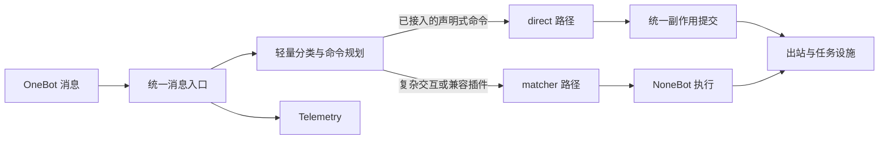

# 统一消息入口架构

本页面向维护 Pallas-Bot 内核与内置插件的开发者，说明统一运行时如何在 `direct` 与 NoneBot `matcher` 之间规划消息，并统一提交可见副作用。插件作者应依赖 [`pallas.api.runtime`](/developer/plugin-development/pallas-api-cookbook#精确命令与统一运行时)，不要直接导入本页提到的内部类型。

这套入口不是对 NoneBot 的整体替换，不要求所有插件迁移，也不改变单机统一运行时的默认部署方式。分片只负责扩展部署拓扑，与消息选择 direct 还是 matcher 是两个维度。

## 主流程

入口位于现有 OneBot / NoneBot 入站门控之后。它保留协议适配、插件加载和 NoneBot 生命周期，只将适合的消息提前交给受约束的 direct handler。`ActionCommitter` 负责 direct 的结构化结果；matcher 仍按 NoneBot 语义执行，二者随后共用发送队列等既有设施。

## 规划与执行

direct 路径按以下顺序工作：

1. 入站层从事件构造 `MessageContext`，记录账号、群、消息文本、路由候选等本次处理所需信息。
2. 生命周期从 `pallas.api.runtime` 的精确文本或前缀命令声明构造 registry snapshot。运行中的一次规划只读取该快照，不让插件注册变化破坏当前决策。
3. `MessagePlanner` 根据消息分类、路由候选与 handler 声明生成 `HandlingPlan`。只有唯一且满足约束的 direct handler 才会进入 direct 执行；其他情况明确交回 matcher。
4. `MessageRuntime` 执行 handler，并将公共 `DirectCommandResult` 转换为内部 `HandlingOutcome`。
5. `ActionCommitter` 统一提交回复、持久任务、跨 worker 动作和完成效果；提交结果随后写入 telemetry。

planner、registry、`HandlingPlan`、`HandlingOutcome` 和 `ActionCommitter` 都是内部 ABI。插件只声明“哪些命令文本或前缀由谁处理”以及“处理结果包含哪些受支持效果”。前缀声明仍由框架执行 `startswith` 匹配，不接受插件自定义 planner predicate。

## 副作用与失败边界

| 结果 | 内部提交行为 | matcher 行为 |
| --- | --- | --- |
| 回复 | 通过 Bot 发送接口统一发送 | 默认不继续 |
| `DirectWorkJob` | 写入 durable work store，使用幂等键 | 默认不继续 |
| completion effect | 在提交阶段执行并等待完成 | 默认不继续 |
| `matcher_fallback(reason)` | 不允许携带任何副作用 | 回到 matcher |
| `continue_matcher=True` | direct 结果正常提交 | 提交后继续 matcher |

关键不变量是：**只有尚未开始 direct 副作用时才能 fallback。** handler 在产生结果前失败，且该 handler 允许错误回落时，可以交回 matcher；显式 `matcher_fallback()` 也必须是无副作用结果。

一旦 `ActionCommitter` 开始提交，下游可能已经接受任务或发送动作。此时提交失败会记录为 `SideEffectCommitError`，但运行时仍把本次消息视为已经由 direct 取得所有权，不再用 matcher 重试。这避免“发送成功但确认失败”一类情况造成重复回复或重复执行。

durable work handler 可以返回 `DirectWorkResult`，其中的 `DirectBotAction` 由 work auxiliary 按顺序交给现有 `bot_action` 设施，单机直接投递，分片时路由到持有目标 Bot 连接的 worker。handler 在返回结果前失败仍使用 work job 的重试策略；结果提交一旦开始便可能已经产生可见动作，此后失败会直接 dead-letter，不再重跑整个 job。

## fallback 与 continuation

fallback 表示 direct **没有处理**本次消息，由 matcher 接管；continuation 表示 direct **已经处理**，但业务明确要求 matcher 继续运行。两者互斥。

常见 fallback 原因包括权限不满足、玩法当前未激活或 handler 约束不成立。continuation 只用于同一消息确实需要 direct 与 matcher 协作的少数场景，不应作为迁移期间的默认保险开关。

## 运行指标

入口持续维护不含消息正文的聚合 ingress 指标，包括消息量、`matchers_selected`、耗时与 direct/matcher 完成结果。它们用于发现过载和选择后续迁移候选；不再写入逐消息的试验 JSONL 或保留灰度差异记录。

## 插件归属与渐进接入

每个命令声明包含稳定的 `handler_id`、插件 `module`、精确文本或前缀集合和 `command_id`。`module` 用于生命周期清理和候选归属，`command_id` 复用现有权限配置。同模块内相交的精确文本/前缀声明会在构造快照时跳过；多个 direct handler 仍声称同一条消息时，planner 不猜测胜者，而是保守交回 matcher。

迁移单位是**命令**，不是插件：一个插件可以让高频、精确、单次处理的命令走 direct，同时保留救人、补枪、状态 matcher 或多步会话等复杂路径。社区插件可以永久只使用 matcher；只有确实需要缩短高频命令路径时才接入公共 API。

## 代码位置

| 职责 | 位置 |
| --- | --- |
| 插件公共声明与结果类型 | `pallas/api/runtime/__init__.py` |
| planner、registry、模型与提交器 | `pallas/core/platform/message_runtime/` |
| durable work result 提交 | `pallas/core/platform/work_jobs/` |
| NoneBot 入站衔接与路径指标 | `pallas/core/platform/ingress/` |
| direct / matcher 历史指标展示 | `packages/pb_webui/` |
| 公共 API 契约测试 | `tests/api/runtime/` |
| 内核运行时测试 | `tests/platform/message_runtime/` |

对外接入示例见 [`pallas.api` Cookbook](/developer/plugin-development/pallas-api-cookbook#精确命令与统一运行时)；用户能感知的消息流程见[核心概念](/guide/concepts#消息怎么在-牛牛-中流动)。
