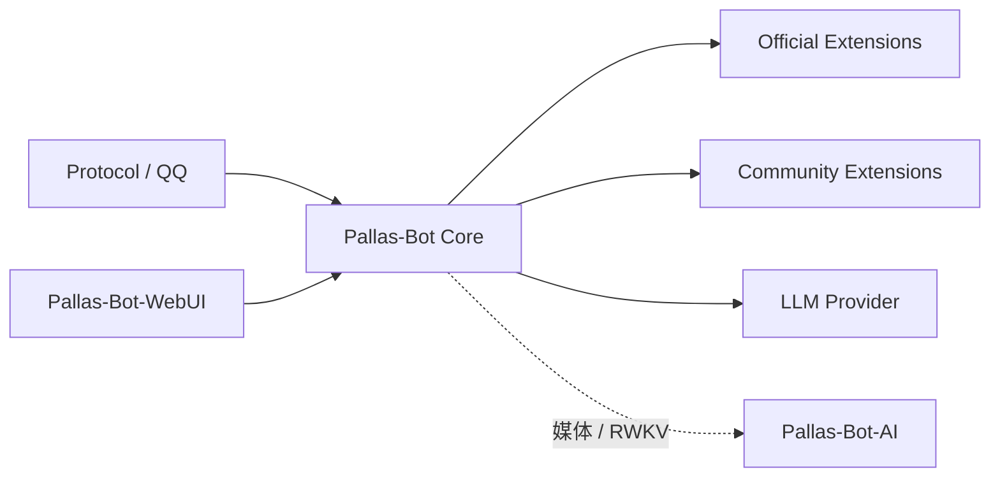

# 架构总览

这页帮助刚接触 Pallas-Bot 的开发者判断代码和能力应放在哪里，并找到下一步该读的架构文档。先理解主仓、WebUI、AI 与扩展的边界；只有要改对应领域时，再深入分片、配置或 LLM Agent。

Pallas-Bot 的可执行边界是：主仓承载运行时与产品语义；WebUI、AI、官方插件为独立协作仓；玩法能力不默认回流进 core。

## 先从这里开始

如果你的目标是：

- 写一个站点私有或社区插件，先读 [写第一个插件](/developer/plugin-development/first-plugin)，并只使用 `pallas.api.*`。
- 判断新能力是否应进入主仓，先看下面的「归属判定」，再读 [Core 与扩展](core-vs-extensions.md)。
- 修改控制台界面，到 `Pallas-Bot-WebUI` 修改前端源码；`data/pb_webui/public-react/` 是构建后的运行目录。
- 接入普通 LLM 聊天，使用 Bot Provider；Pallas-Bot-AI 只在媒体 runtime、队列、健康、callback 或遗留 RWKV `/api/chat` 等场景需要。

分片、配置存储、后台 work aux、插件治理、Agent 生命周期与输出路径都属于后续专题：当当前工作涉及这些能力时，从文末「按需深入」进入即可。

## 拓扑

## 层职责

| 层 | 职责 | 代码锚点 |
| --- | --- | --- |
| Core | 运行时、ingress、插件加载、cmd_perm / cooldown / help、WebUI 后端、分片、语料与产品记忆边界；含 LLM Agent、Provider 调用与工具循环 | `pallas/`、`packages/` |
| WebUI | 前端页面与交互；构建后同步到主仓运行目录 | 仓 `Pallas-Bot-WebUI` → `data/pb_webui/public-react/`（默认 React） |
| AI | 可选媒体 runtime、队列、健康、callback，以及遗留 RWKV `/api/chat` | 仓 `Pallas-Bot-AI` |
| Official Extensions | 官方维护、可独立安装的玩法与外部能力 | 兄弟仓 / PyPI |
| Community Extensions | 第三方与站点私有能力 | Git / 本地 / 索引 |

## 归属判定

| 条件 | 归属 |
| --- | --- |
| 全站点共用的平台基础设施或产品底盘 | Core |
| 可独立发版、按需安装的玩法 / 外部集成 | Official Extension |
| 第三方、实验、站点私有 | Community / `local/plugins/` |

细则：[Core 与扩展](core-vs-extensions.md)。

## 主仓路径

| 路径 | 作用 |
| --- | --- |
| `pallas/` | 内核、平台、产品、console |
| `packages/` | 内置插件：core（`CORE_PLUGIN_NAMES`）、bundled play（`BUNDLED_PLAY_PLUGIN_NAMES`）、以及 `EXTRA_PLUGIN_PACKAGES` 对应的官方 extra |
| `tests/` | 内核 / 平台 / 插件 / 分片回归 |
| `docs/` | maintainer + developer 主线 |
| `local/plugins/` | 站点私有插件（不入库） |
| `data/` | 运行时数据（不入库） |

## LLM Agent

通用 LLM 聊天完整运行在 `pallas/product/llm`。`packages/llm_chat`、接话等入口调用
`client.submit_chat_task`，由 `kernel_runner` 在 Bot 进程内执行 Provider 请求、工具循环与结果投递；
不经 Pallas-Bot-AI、`:9099` 或 HTTP callback。

工具循环会把模型返回的 tool call 逐轮执行，再把结果带回模型生成可见回复。涉及外部异步任务的工具只负责派发：
结果在完成后由对应任务通道补发，因此不会阻塞本轮聊天投递。

进程内投递实现在 `pallas/product/llm/delivery.py`；`pallas/core/platform/ai_callback/runner.py` 仅保留 HTTP callback 薄壳。控制台 LLM 运维与聊天路径分别经 `ops_api` / `runtime_api` 门面导入（见 `tools/check_llm_import_boundaries.py`）。

## 禁止假设

| 禁止 | 正确做法 |
| --- | --- |
| 把 `data/pb_webui/public-react/` 当前端源码 | 改 `Pallas-Bot-WebUI` 后同步产物 |
| 把 AI runtime 当产品语义层 | 牛格 / 语料 / 人格边界留在主仓 |
| 把 Pallas-Bot-AI 当普通聊天前提 | `@` 聊天配置 Bot Provider；AI 仅媒体 / RWKV |
| 新玩法默认进 core | 按 [Core vs 扩展](core-vs-extensions.md) 判定 |
| 社区插件 import `pallas.core.*` | 只用 `pallas.api.*`；core 插件优先 `pallas.api`（perm/commands/limits/storage/config） |

## 按需深入

| 主题 | 文档 |
| --- | --- |
| Core 与扩展判定 | [core-vs-extensions.md](core-vs-extensions.md) |
| 分片运行时 | [shard-runtime.md](shard-runtime.md) |
| 后台任务与 work aux | [work-aux.md](work-aux.md) |
| 配置存储 | [config-storage.md](config-storage.md) |
| 插件治理 | [plugin-governance.md](plugin-governance.md) |
| Bot 内置 Agent 生命周期 | [agent-lifecycle.md](agent-lifecycle.md) |
| LLM 输出路径（@ / 接话 / 表达库） | [llm-output-path.md](llm-output-path.md) |
| 插件骨架 | [Golden Plugin](/developer/plugin-development/golden-plugin) |

入门参考：

- [仓库布局](/developer/reference/repo-layout)
- [Platform API](/developer/reference/platform-api)
- [Reload 与 Activation](/developer/plugin-development/reload-and-activation)
