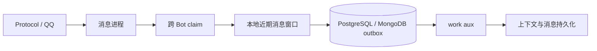

# Work Aux

`work aux` 是与消息进程并列的后台消费者。它把可重试、会写数据库或产生派生数据的工作移出 ingress；普通单进程部署不需要 Redis，任务默认保存在当前 PostgreSQL 或 MongoDB 的 outbox。

## 消息路径



主进程只保留下一次接话所需的近期窗口，并冻结当前消息及其前序快照后提交 outbox。`work aux` 领取带租约的任务，执行上下文学习、消息持久化及其他派生工作；异常会按任务状态重试。这样辅进程延迟或短暂重启不会阻塞命令、回复和多 Bot claim。

当前首个任务类型是 `repeater.learn`。它不会修改消息进程的内存窗口，因此新消息在 aux 尚未完成时仍可参与后续接话。

## 运行与扩展

`uv run pallas`、`uv run pallas run unified` 会同时维护消息实例与一个 `work aux`；`uv run pallas status` 显示它的 pid 和日志。完整分片启动也只维护一个 aux，避免每个 worker 重复拉起消费者。

多机或更高吞吐时可手动启动更多 `bot_work_aux.py` 消费者。数据库领取使用租约，多个消费者不会领取同一条正在持有租约的任务。先观察 outbox 积压与数据库写入能力，再增加消费者；不要把 worker 数与 QQ 账号数绑定。

## Redis

Redis 不参与默认 work aux 的可靠性：PostgreSQL / MongoDB outbox 是任务事实源。Redis 用于分片协调、本机 Embedding，以及 Pallas-Bot-AI 的 Celery broker、结果和 GPU 锁；这些用途可共用一个 Redis，以键前缀或逻辑 DB 隔离。

本机希望由项目创建 Redis 时执行：

```bash
uv run pallas redis start
```

该命令会先复用可达的 `REDIS_URL`；未配置时用 Docker 创建带持久卷的 `redis:7-alpine`，仅绑定 `127.0.0.1` 的随机端口，再写入 `data/pallas_config/webui.json`。没有 Docker 时不会阻止单机 Bot 或 work aux 启动。
