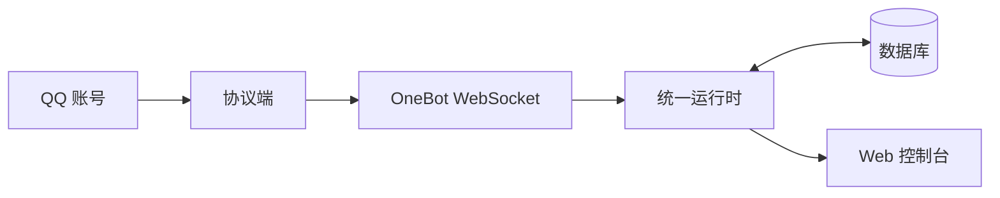
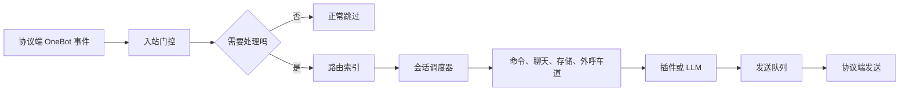

# 牛是怎么拼起来的

读完本页后，你能分清协议端、Bot、数据库与网页控制台各自管什么，并知道日常改配置该找哪一块。

## 四块组件

| 组件 | 职责 |
| --- | --- |
| 协议端 | 替 QQ 登录、收发消息（如 NapCat） |
| Pallas-Bot | 处理消息：复读、帮助、插件玩法等 |
| 数据库 | 存储语料、群配置、`bot_config` 等 |
| Web 控制台 | 改配置、看日志、装插件（路径 `/pallas/`） |

## 通信路径


- 协议端与 Pallas-Bot 通过 **OneBot WebSocket** 通信。
- Web 控制台与协议端管理页由 **同一 Bot 进程** 提供，无需另起服务。
- 日常改插件配置：控制台保存即可；装 / 卸官方扩展需重启 Bot。
- 端口、超管、数据库连接写在 `config/pallas.toml`；插件项写入 `data/pallas_config/webui.json`。

## 运行方式

Pallas-Bot 默认使用**统一运行时**：一个 Bot 进程接入本机全部 QQ 账号，协议端的反向 WebSocket 统一连到这个进程。它不需要 Redis，也不要求按账号拆分多个 Bot 进程。



统一运行时会将命令、聊天和后台任务分开调度：命令优先进入处理；同一会话按顺序执行；队列接近压力时先降低非必要的学习、检索等后台工作，而不是直接丢弃正常聊天消息。控制台可查看运行指标与队列状态。

常用命令：

```bash
uv run pallas
uv run pallas status
uv run pallas restart
```

修改协议端的 WebSocket 地址后，重启对应协议端实例使新地址生效。统一运行时默认使用 `8088` 端口，实际端口以 `config/pallas.toml` 为准。

当需要多机部署、账号级隔离或高可用时，才使用分片。此时分片是集群拓扑，而不是单机减少消息负载的默认手段；跨进程协调需要 Redis。详见[分片部署](/maintainer/deploy/sharded)。

## 消息怎么在 牛牛 中流动

一条群消息进入统一运行时后，并不是立刻交给全部插件逐个尝试。牛牛 会先完成轻量判断，再把需要处理的工作交给对应队列：



### 1. 入站门控

牛牛 会跳过自己或已知其他牛发出的群消息；消息若 `@` 了某些牛牛账号，则只交给被 `@` 的账号。普通消息会经本机、联邦或分片领取，未领取到的实例跳过；全员响应玩法会绕过领取竞争，让符合目标条件的账号都收到事件。

控制台中的 `preprocessor_dropped` 记录事件预处理器主动跳过的次数。入站门控的自发消息、非目标 `@`、抢占失败等跳过不会统一计入这个指标；它也不表示高峰时聊天被丢弃。

### 2. 路由与会话调度

命令根据前缀和完整文本只激活相关插件；普通聊天默认只运行接话、复读等被动模块，避免每条消息扫描全部插件。

随后群消息按“账号 + 群”进入会话调度器：同一群同一账号的消息保持顺序，不同群可以公平并行。调度队列达到上限时，新的入站工作会等待空位而非静默删除；但进入具体处理车道后，若在等待预算内仍无空位，该次插件执行会跳过，命令流量可收到忙回复。

### 3. 处理车道与高峰策略

插件按命令、工具、聊天、存储和远程外呼等车道分别限并发；命令不与慢速外呼共用额度，数据库压力下存储车道还会收紧。

默认高峰策略是**降质而不是丢聊天**：保留聊天 matcher 与本地接话，同时跳过复读学习、LLM 接话等附属工作，并暂停语料预取。只有管理员显式开启极端过载保护，聊天才可能整段跳过。

### 4. 出站发送

群消息、私聊和转发会进入发送队列，并按账号限速后再交给协议端。它们属于高优先级；点赞类动作在队列半满时就可能跳过，队列满时戳一戳等其他非高优先级动作也可能被丢弃。高优先级消息会优先入队，但若入队等待超时仍会失败并向调用方报错；协议端实际发送失败会记入错误计数，不会伪装成已发送。

### 看运行状态

在控制台的入站调度面板，重点关注：

| 指标 | 含义 |
| --- | --- |
| `chatter_overload_dropped` | 因极端过载保护而跳过的聊天数；默认应为 0。 |
| `conversation_scheduler.pending` | 正在等待处理的会话任务数。 |
| `send_queue.depth` / `send_queue.dropped` | 正在等待发送的消息数 / 被队列丢弃的动作数。 |
| `send_queue.errors` | 协议端发送失败次数，应结合日志处理。 |
| `ingress_duration_ms_p95` | 入站处理耗时的高位值；升高说明繁忙，但不单独等同于丢消息。 |

## 成功信号

- 能说明：群消息先经协议端，再到 牛牛；控制台改的是同进程配置。
- 知道改端口 / 超管找 `pallas.toml`，改插件与 AI 等日常项找控制台。
- 知道单机优先使用统一运行时，只有部署边界需要扩展时再用分片。

## 接下来做什么

- 第一次启动 → [快速开始](/guide/quickstart)
- 连 QQ → [连接 QQ](connect-qq.md)
- 配置落盘规则 → [配置从哪改](config.md)
