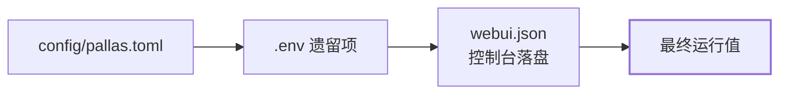

# 配置从哪改

Pallas-Bot 的配置分两类：「让 Bot 启动起来」的配置在 `pallas.toml`，「让功能按预期工作」的配置通常在网页控制台完成。日常改配置从控制台开始，启动前设置才需要编辑 `pallas.toml`。

::: tip
第一次部署时，只需要先填写 `config/pallas.toml` 中的超管、监听地址和数据库。Bot 启动后，再到网页控制台配置插件、权限和 AI 能力。
:::

## 日常配置从控制台开始

登录控制台后，按要完成的事情进入对应页面：

| 要完成的事 | 页面 |
| --- | --- |
| 给某只牛配置号主 | **实例与连接**，详见 [号主](bot-owner.md) |
| 安装或更新官方插件 | **插件商店** |
| 开关插件、调整冷却 | 对应插件页面 |
| 改命令可用范围 | **命令权限** |
| 配 Provider、聊天或媒体能力 | **AI 配置** |
| 配语料和通用服务地址 | **通用配置** |

只想让 `@牛牛` 聊天时，在 **AI 配置** 配好 Provider 即可；唱歌、TTS 和遗留 RWKV 需额外部署 AI Runtime，见 [LLM 对话、媒体与 AI Runtime](ai-runtime-choice.md)。

## 启动前设置：编辑 `pallas.toml`

端口、数据库和超管属于启动前设置，修改后需重启 Bot 生效。编辑 `config/pallas.toml`：

```toml
[bootstrap]
host = "0.0.0.0"
port = 8088
superusers = ["你的QQ号"]
db_backend = "postgresql"

[bootstrap.postgres]
host = "127.0.0.1"
port = 5432
user = "pallas"
password = "pallas"
db = "PallasBot"
```

从 `config/pallas.example.toml` 复制为 `config/pallas.toml` 再改。

## 三处的职责

| 位置 | 什么时候改 | 典型内容 |
| --- | --- | --- |
| `config/pallas.toml` | 首次部署，或修改端口、数据库、分片等进程级设置 | `superusers`、监听地址、数据库 |
| 网页控制台 | 日常管理 | 插件开关、命令权限、AI 配置、语料与服务地址 |
| `.env` | 维护旧部署或第三方 NoneBot 插件时 | 遗留兼容项；不再新增主能力键 |

控制台保存的内容会写入 `data/pallas_config/webui.json`。这是保存结果，不是日常编辑入口。

同名配置的覆盖顺序为：`pallas.toml` → `.env` → `webui.json`，后者优先。



## 保存后如何确认

多数控制台配置会热重载：保存后，正在运行的 Bot 会重新读取配置，不需要中断服务。

| 需要重启 Bot | 通常保存后生效 |
| --- | --- |
| 端口、数据库连接 | 多数插件页配置（已接热重载） |
| 分片 / 进程角色 | 通用配置段、命令权限 |
| 官方插件装 / 卸 / 升级 | 冷却、策略类开关 |

控制台显示“需重启”时再重启。保存后未生效，先检查是否有同名项被 `webui.json` 覆盖，再查看运行日志。

## 需要更多细节时

| 文档 | 何时看 |
| --- | --- |
| [网页控制台](web-console.md) | 控制台的登录、侧栏和保存方式 |
| [号主](bot-owner.md) | `admins` 的作用和配置方法 |
| [配置要点（生产）](/maintainer/reference/config-production) | 部署检查清单与 `[bootstrap]` 细节 |
| [配置参考](/maintainer/reference/config) | 热生效边界与排障顺序 |
| [配置存储](/developer/architecture/config-storage) | 开发向合并与读取合同 |
