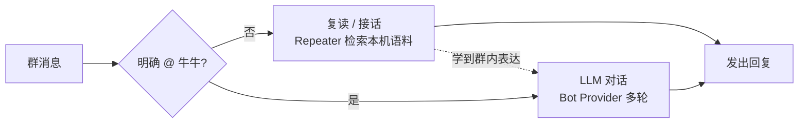

# `@牛牛` 与复读

牛牛有两条回复路径：**复读 / 接话**日常自动触发，由 Repeater 用本机语料生成；**`@牛牛` LLM 对话**走 Bot Provider 的多轮聊天。Repeater 学到的群内表达可指导 LLM，但 LLM 不反向决定 Repeater 发哪句。

## 两条路径

| 路径 | 触发条件 | 行为 |
| --- | --- | --- |
| 复读 / 接话 | 日常群聊自动 | Repeater 从本机语料中检索、排序并直接发送 |
| `@牛牛` LLM 对话 | 明确 @ 牛，或明文点到该号专属自称 | 走 LLM 对话（仍带牛格与群味） |

LLM 对话走 **Bot Provider**（控制台 **AI 配置**）。**AI Runtime** 只用于唱歌 / TTS 等媒体与遗留 RWKV，与本页 LLM 对话路径无关。

明文点名时：专属自称（登录名 / 学到的外号，含「豆包牛牛」拆出的「豆包」等）优先唤起对应号；通称「牛牛」仍可唤起，但不独占。细则见 [persona · 通称与专属自称](/plugins/persona#通称与专属自称)。

## 复读 / 接话

- 日常群聊自动触发，优先本机学到的语料。
- 受牛格、群风格、单群表达参考影响。
- 不调用 LLM 选句、润色、拼接或补写，Provider 忙碌也不会拖慢 Repeater 接话。

接话积极程度、语料来源与多牛协同等可在控制台调整；详见 [复读插件](/plugins/repeater)。

## `@牛牛` LLM 对话

1. 在控制台 **AI 配置** 配好 Bot Provider 并测通。
2. 打开总闸 **`LLM_CHAT_ENABLED`**（**AI 配置 → 接话**）。
3. 在群里明确 `@牛牛`，或喊该号专属自称试一句。

比日常接话更自由：可带会话、记忆等能力；同样会吃到牛格、情感与本群 **表达参考**。少量场景会从单群表达库取出已通过相关性与近期回复去重的真实语料直接作答；该路径受滚动窗口 15% 配额约束，命中时不请求 Provider，也不对语料内容作额外价值判断。详见 [智能对话（llm_chat）](/plugins/llm_chat) 与 [AI 扩展](ai.md)。

## 反哺与表达库

AI **成功发出**之后，还可能：

| 机制 | 作用 |
| --- | --- |
| 反哺纠错加权 | 成功发出的回复会被记入会话反馈；坏样本可在会话页排除，纠错加权影响后续接话选句（打分） |
| 单群表达库 | 每只牛在每个群各自学一份「什么场合常说什么」，作为表达参考注入明确唤醒的 LLM 对话；不跨群、也不跨同群其他牛共享 |
| 语义风格指导 | 从本群真人接话里提炼「触发什么话、怎么接」的参考（直接对 + 节奏 + 抽象策略），注入 LLM 对话，让牛牛越聊越像这个群的人 |

同群不同牛的表达风格互不影响；想让它重学可发 `@牛牛 重置表达`（只清当前这只牛、当前这个群）。

语义风格会学三样东西：**触发句→接话的直接对**（如「快了」→「确实可以」）、**群节奏基线**（单泡占比、段长中位，决定回一句多长）、**抽象接话策略**（类似场景真人怎么接；仅当此群还没有足够的直接对时兜底注入）。直接对来自真人确认的接话样本，越聊积累越多，参考就越贴这个群。

因此偶发「说法变了 / 语料变多」往往是闭环在学，不一定是故障。相关开关在控制台 **AI 配置**（如收集反哺、表达注入 / 学习）。

旧版 Repeater 的 LLM 选句、润色和无语料补写在线任务均已删除；日常接话始终直接投递真实语料。

## 成功信号

- 未开 `LLM_CHAT_ENABLED` 时，日常接话仍可走语料。
- 打开总闸并 Provider 测通后，`@牛牛` 能收到 LLM 对话回复；日常接话仍由 Repeater 即时发送语料。

## 接下来做什么

- [`@牛牛` LLM 对话](/plugins/llm_chat)
- [复读 / 接话](/plugins/repeater)
- [牛格与群味](/plugins/persona)
- [AI 扩展](ai.md) · [LLM 对话、媒体与 AI Runtime](ai-runtime-choice.md)
- 想了解模型看到了什么、回复被怎么拦：[牛牛的上下文与回复护栏](llm-context-and-guardrails.md)
- 开发者：[LLM 输出路径](/developer/architecture/llm-output-path)
