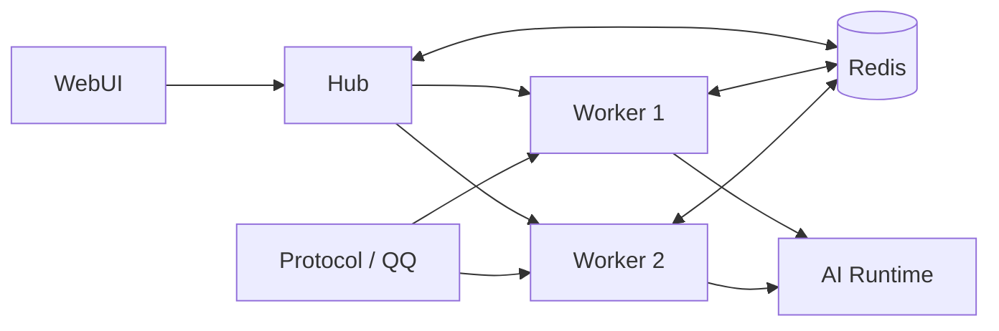

# 分片部署

单进程扩成 hub + worker。依赖明确的角色分工、共享 `data/`，以及 Redis 协调。

## 适用条件

| 适合 | 不适合 |
| --- | --- |
| 多 Bot 账号同时在线 | 仅 1–2 只 Bot |
| 多协议实例并行接入 | 尚未验证单进程瓶颈 |
| 单进程已卡顿、连接压力大或调度抖动 | 无法提供共享 `data/` 与 Redis |
| 需拆开 WebUI / 协议端 / AI 回调与消息处理 | |

## 结构图



## 角色分工

| 角色 | 职责 |
| --- | --- |
| `hub` | WebUI、协议端管理、注册表、部分协调、AI callback 入口 |
| `worker` | 消息处理、群聊玩法、绝大多数业务插件 |
| `Redis` | 跨 worker claim、活动协调、部分广播与状态同步 |
| `Protocol` | QQ 协议接入；反向连接到对应 **worker**（不是 hub） |

## 前置条件

### 1. 共享 `data/`

hub 与所有 worker 必须共用同一份 `data/`，否则会错乱：

- `registry.json`
- 协调状态
- 协议端账号映射
- worker presence
- WebUI 聚合状态

### 2. Redis

4.0 分片关键协调依赖 Redis（单进程不强制）。

`config/pallas.toml` 的 `[env]`：

```toml
[env]
REDIS_URL = "redis://127.0.0.1:6379/0"
```

### 3. 端口规划

- hub：`8088`
- worker：从 `8090` 起分配

协议端 `ws_url` 必须与实际 worker 端口一致。

## 启动

::: tip
优先用仓库脚本，勿手动拼环境变量起多个进程。
:::

```bash
./scripts/run_sharded_bot.sh start
./scripts/run_sharded_bot.sh status
./scripts/run_sharded_bot.sh stop
```

常见补充：

```bash
./scripts/run_sharded_bot.sh start --workers 5
./scripts/run_sharded_bot.sh restart
./scripts/run_sharded_bot.sh test init
./scripts/run_sharded_bot.sh test start
```

脚本处理：hub / worker 拉起、注册表端口对齐、协议端 `ws_url` 同步、日志目录与 PID。

## 入口与运行

| 对外 | 对内 |
| --- | --- |
| WebUI 主要访问 hub | worker 跑大多数插件 |
| AI callback 先打到 hub | hub 聚合 worker 状态给控制台 |
| 协议端账号连到 worker | 无 Redis 时跨 worker 能力失效 |

## 三项检查

### 1. 分片是否启动完整

- `./scripts/run_sharded_bot.sh status`
- `data/pallas_shard/logs/hub.log`
- `data/pallas_shard/logs/worker-*.log`

分片问题查分片日志，不是单进程日志。

### 2. 协议端是否连到正确 worker

- `data/pallas_shard/registry.json`
- 协议端实例 `ws_url`
- 监听端口与注册表是否一致

### 3. WebUI 数据是否为 hub 聚合

控制台多数页面展示 hub 聚合后的 worker 状态，不是 hub 本地状态。「插件没加载」「cooldown 不全」「Bot 在线态不对」时，核对 worker 侧是否上报。

## 日志与状态文件

- `data/pallas_shard/logs/hub.log`
- `data/pallas_shard/logs/worker-0.log`
- `data/pallas_shard/logs/worker-1.log`
- `data/pallas_shard/registry.json`
- `data/pallas_shard/stats/worker-*.json`

::: tip
问题只在某个 Bot / 群 / 玩法时，先收窄到对应 worker。
:::

## 常见故障

### Bot 在线，消息不处理

- 协议端是否连到正确 worker
- worker 日志是否持续异常
- Redis 是否可达

### WebUI 能开，插件状态不对

- hub 是否拿到 worker 元数据
- 插件是否实际跑在 worker
- `stats/worker-*.json` 与注册表

### AI 回调到了，结果未回群

- callback 是否先打到 hub
- hub 是否转发到目标 worker
- worker 是否仍在线

## 运维要点

- 分片下 Redis 为必需依赖
- 生产用脚本或编排统一管理 hub 与 worker；勿只监控 hub
- 新增 Bot、迁移协议端、调整 worker 数量后，重新核对注册表与 `ws_url`

## 相关阅读

- [维护者排障](/maintainer/operate/troubleshooting)
- [单进程部署](single-process.md)
- [分片运行时（开发）](/developer/architecture/shard-runtime)
