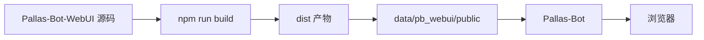

# WebUI

部署、更新和排查 WebUI。

## 三层结构

| 层 | 路径 |
| --- | --- |
| 前端源码 | `Pallas-Bot-WebUI` |
| 运行产物 | `data/pb_webui/public/` |
| 后端 | `pb_webui` · `/pallas/api` |

Bot 挂载静态资源时读的是运行产物，不是源码仓。

| 操作 | 结果 |
| --- | --- |
| 改前端页面 / 样式 | 在 `Pallas-Bot-WebUI` 改 → build → 同步产物 |
| 只改主仓 `data/pb_webui/public/` | 下次构建同步会被覆盖 |
| 只改源码仓、未 build / 同步 | 线上页面不变 |

## 适用场景

- 部署、更新或排查 WebUI
- 页面与源码不一致，怀疑资源未同步
- 区分前端仓、主仓 API、静态产物问题

## 运行链路



链路任一步未完成，浏览器看到的版本可能与预期不符。

## 常用操作

### 1. 使用控制台

确保 `data/pb_webui/public/` 可用且 Bot 已启动：

```text
http://<host>:8088/pallas/
```

### 2. 更新 WebUI 资源

拿到新的 `dist.zip` 或构建产物后：

1. 停止或避开当前写入过程
2. 解压或覆盖到 `data/pb_webui/public/`
3. 重启 Bot 或刷新静态资源缓存
4. 浏览器强制刷新，确认版本已变

### 3. 修改前端源码并上线

1. 在 `Pallas-Bot-WebUI` 改源码
2. 执行 `npm run build`
3. 将 `dist` 同步到主仓 `data/pb_webui/public/`
4. 用实际运行中的 Bot 页面验证

## 按现象检查

### 页面内容旧，后端接口是新的

静态资源未同步，或浏览器缓存未刷新。

### 前端改了，线上无变化

- 是否改的是 `Pallas-Bot-WebUI`（而非主仓运行目录）
- `npm run build` 是否成功
- 产物是否同步到 `data/pb_webui/public/`

### API 正确，UI 未展示

前端渲染或契约字段不匹配；通常不是静态资源挂载问题。

### 页面 404 或空白

- `data/pb_webui/public/` 是否完整
- Bot 是否挂载了 `pb_webui`
- 路径是否为 `/pallas/`

## 部署要点

- WebUI 按独立产物管理，与普通 Python 插件分开
- Release 优先用已构建的 `dist.zip`
- 源码部署：「改源码」与「同步产物」分两步

## 与主仓 API

| 侧 | 仓库 / 路径 |
| --- | --- |
| 页面、路由、样式、交互 | `Pallas-Bot-WebUI` |
| API、配置落盘、热重载 | 主仓 `pb_webui`、`src/console/webui/` |

::: tip
按钮无响应、展示错、布局异常 → 前端。  
保存失败、500、数据不对、配置未落盘 → 主仓后端。
:::

## 排障顺序

1. 访问路径 `/pallas/`
2. `data/pb_webui/public/` 是否完整
3. 强制刷新浏览器缓存
4. Bot 日志中 `pb_webui` 是否挂载
5. 区分前端与 API

## 相关阅读

- [维护者排障](/maintainer/operate/troubleshooting)
- [WebUI 后端配置与热重载](/common/webui)
- [WebUI 前端开发](/developer/webui)
