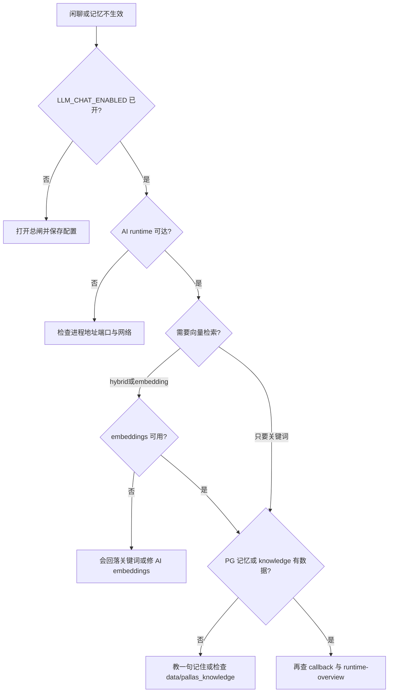

# LLM 与 AI 运维

::: warning
`@` 无回复或记不住旧事时，优先查：`LLM_CHAT_ENABLED`、AI Runtime 可达性、callback 是否回到 Bot。
:::

## 优先确认

1. **`LLM_CHAT_ENABLED`** 是否为开（总闸关闭时，后端健康也不会闲聊）
2. **AI runtime** 是否可达（`AI_SERVER_HOST` / `AI_SERVER_PORT`，默认 `9099`）
3. **callback** 是否回到 Bot（AI 任务成功 ≠ 群里一定有字）

再查任务与会话状态是否可观察。

## 闲聊 / 记忆不生效

## Bot 与 AI Runtime

| 组件 | 职责 |
| --- | --- |
| `Pallas-Bot` | 触发、权限、发消息、接收 callback |
| `Pallas-Bot-AI` | AI / 媒体任务执行 |

功能不可用时，两侧都可能出错。

## 相关配置

- `LLM_CHAT_ENABLED`
- `AI_SERVER_HOST`
- `AI_SERVER_PORT`

::: warning
`LLM_CHAT_ENABLED` 未开时，即使 AI 后端在线也不会触发多数闲聊能力。
:::

## 按现象检查

### `@` 闲聊无响应

- LLM 总开关
- AI runtime 连通性
- 日志中是否有请求发出

### 媒体任务发出但无结果

- AI runtime 是否已接收任务
- callback 是否打回 Bot
- Bot 是否成功处理 callback

### 页面显示 AI 离线

- AI runtime 进程是否运行
- Bot 到 AI 的地址配置
- 网络与端口是否可达

## 控制台接口

排前端或反代问题时可直接访问：

| 接口 | 用途 |
| --- | --- |
| `/pallas/api/auth/setup-status` | 是否仍处默认口令 / 首次引导 |
| `/pallas/api/common-config/llm/wizard/status` | AI 服务、provider、总闸哪一步未就绪 |
| `/pallas/api/common-config/llm/runtime-overview` | health、模型、任务统计、conversation kernel |

## 记忆与 session

运行时 **session / task state** 以 **Pallas-Bot-AI** 为执行面；Bot 负责产品侧记忆策略与注入。

| 层级 | 位置 | 用途 |
|------|------|------|
| 会话窗口 | Bot `session_store` + AI 回调 | 群内多轮可见历史 |
| 超长摘要 | metadata `session_summary` → AI | 窗口外压缩上下文 |
| 群记忆（teach / auto_episode） | Bot PG `llm_memory_entry` | 「记住：」与启发式旧事；默认 **hybrid** 检索（`LLM_VECTOR_RETRIEVE`） |
| 关系便签 | Bot PG | 对用户的稳定关系备注 |
| 知识源 | 插件声明 + `data/pallas_knowledge/` | FAQ / 本地文档块注入 |

### 群记忆 / RAG 开关

| 变量 | 默认 | 说明 |
|------|------|------|
| `LLM_MEMORY_RAG_ENABLED` | 开 | 群记忆读写与注入 |
| `LLM_VECTOR_RETRIEVE` | `hybrid` | 关键词+向量；AI embeddings 不可用时回落关键词 |
| `LLM_EMBEDDING_MODEL` | `stub` | 与 AI 仓一致 |
| `LLM_MEMORY_AUTO_EPISODE_ENABLED` | 开 | 有价值发言自动写入 episode |
| `LLM_KNOWLEDGE_SOURCES_ENABLED` | 开 | 知识源总闸 |
| `LLM_KNOWLEDGE_FILE_INGEST_ENABLED` | 开 | 扫描 `data/pallas_knowledge/` |
| `LLM_RELATIONSHIP_NOTES_ENABLED` | 开 | 关系备注 |

模型也可通过 tools `memory.search` / `memory.save` 主动检索与写入。控制台：`GET/POST /pallas/api/llm/conversation-kernel/memory`、`GET /pallas/api/llm/knowledge/sources`。

排障：会话「记不住」先查 AI 任务与 callback；群记忆不生效再查 PG、上述开关与 embeddings 连通性。

## callback

AI runtime 任务成功，不等于群里一定能收到结果。中间还经过：

1. callback 回到 Bot
2. Bot 路由到正确上下文
3. 最终消息发送

「AI 端执行成功但群里没消息」时，同时查 Bot 侧路由与发送。

## Ollama GPU 回退 CPU（推理极慢）

Ollama 在 Docker + GPU 下长跑后，容器内 NVML 可能断联，HTTP 仍 200 但推理回退 CPU。探活与 cron 见 **Pallas-Bot-AI**：[docs/operate/ollama-gpu-watchdog.md](https://github.com/PallasBot/Pallas-Bot-AI/blob/main/docs/operate/ollama-gpu-watchdog.md)（`scripts/ollama_gpu_watchdog.sh --fix`）。

## 纯远端 API（无 Ollama）

未部署本地模型、仅用第三方 OpenAI 兼容 API 时，见 **Pallas-Bot-AI**：[docs/deploy/remote-only.md](https://github.com/PallasBot/Pallas-Bot-AI/blob/main/docs/deploy/remote-only.md)。`/health.llm.provider_mode` 应为 `remote_only`。

## 相关阅读

- [AI Runtime 安装](/maintainer/install/ai-runtime)
- [排障](troubleshooting.md)
- [架构总览](/developer/architecture/overview)
