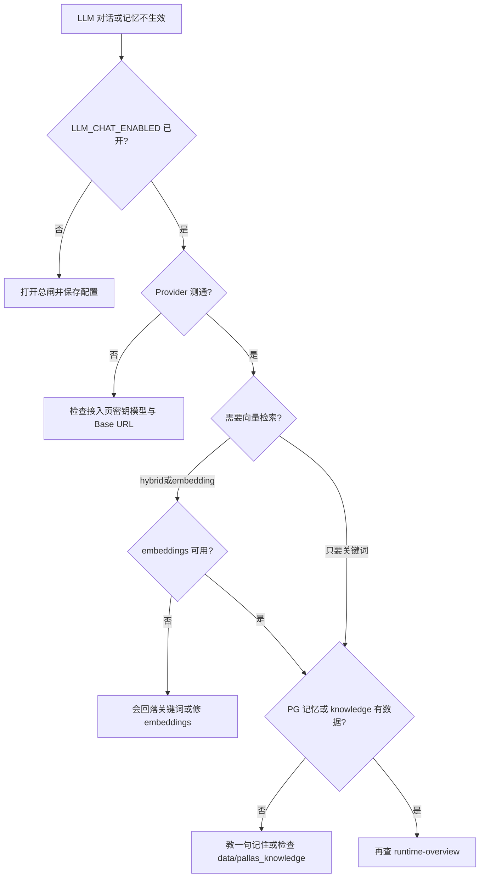

# LLM 与 AI 运维

本页按现象排查 LLM 对话、记忆与媒体任务。普通 LLM 聊天走 Bot Provider；Pallas-Bot-AI 仅用于媒体 / 遗留 RWKV。

::: warning
`@` 无回复或记不住旧事时，优先查：`LLM_CHAT_ENABLED`、**接入** Provider 是否测通。媒体任务才查 AI Runtime / callback。
:::

## 优先确认

1. **`LLM_CHAT_ENABLED`** 是否为开（总闸关闭时不会聊天）
2. **Provider**（AI 配置 → 接入）是否可达；默认聊天不依赖 `:9099`
3. 媒体任务：**AI Runtime**（`AI_SERVER_*`）与 **callback** 是否回到 Bot

再查任务与会话状态是否可观察。

## LLM 对话 / 记忆不生效

```mermaid
flowchart TD
  Start[LLM 对话或记忆不生效] --> Gate{LLM_CHAT_ENABLED 已开?}
  Gate -->|否| OpenGate[打开总闸并保存配置]
  Gate -->|是| Prov{Provider 测通?}
  Prov -->|否| FixProv[检查接入页密钥模型与 Base URL]
  Prov -->|是| Emb{需要向量检索?}
  Emb -->|hybrid或embedding| EmbOk{embeddings 可用?}
  EmbOk -->|否| Fallback[会回落关键词或修 embeddings]
  EmbOk -->|是| Store{PG 记忆或 knowledge 有数据?}
  Emb -->|只要关键词| Store
  Store -->|否| Teach[教一句记住或检查 data/pallas_knowledge]
  Store -->|是| Deeper[再查 runtime-overview]
```

## Bot 与 AI Runtime

| 组件 | 职责 |
| --- | --- |
| `Pallas-Bot` | LLM Agent、Provider 调用、会话、工具循环与消息投递 |
| `Pallas-Bot-AI` | 唱歌、TTS 等媒体任务，以及遗留 RWKV 酒后 `/api/chat` |

功能不可用时，先分清是聊天（Provider）还是媒体（Runtime）。

## 相关配置

- `LLM_CHAT_ENABLED`
- Provider（WebUI「AI 配置 → 接入」）
- `AI_SERVER_HOST` / `AI_SERVER_PORT`（仅媒体 / RWKV）

::: warning
`LLM_CHAT_ENABLED` 未开时，即使 AI 后端在线也不会触发多数LLM 对话能力。
:::

## 按现象检查

### `@` LLM 对话无响应

- `LLM_CHAT_ENABLED` 是否开启
- WebUI「AI 配置 → 接入」中 Provider、模型、密钥与 Base URL 是否测试成功
- Bot 日志是否出现 Provider 调用、工具循环或投递失败
- 不要先查 `:9099`、AI Runtime 或 callback；它们不在普通聊天路径上

### 媒体任务发出但无结果

- AI runtime 是否已接收任务
- callback 是否打回 Bot
- Bot 是否成功处理 callback

### 页面显示媒体服务离线

- AI runtime 进程是否运行
- Bot 到 AI 的地址配置
- 网络与端口是否可达

## 控制台接口

排前端或反代问题时可直接访问：

| 接口 | 用途 |
| --- | --- |
| `/pallas/api/auth/setup-status` | 是否仍处默认密钥 / 首次引导 |
| `/pallas/api/common-config/llm/runtime-overview` | health、模型、任务统计、conversation kernel |

## 记忆与 session

多轮 **session** 与群记忆由 **Bot 内核**落盘（PG / Mongo）；聊天不再经 AI 仓维护 session。

| 层级 | 位置 | 用途 |
|------|------|------|
| 会话窗口 | Bot `session_store`（PG / Mongo） | 群内多轮可见历史 |
| 超长摘要 | Bot session metadata `session_summary` | 窗口外压缩上下文 |
| 群记忆（teach / auto_episode） | Bot PG / Mongo `llm_memory_entry` | 「记住：」与启发式旧事；`LLM_VECTOR_RETRIEVE` 使用 real embedding 时由 Bot Provider 配置；`stub` 或 embedding 调用失败时实际回落关键词检索 |
| 关系便签 | Bot PG / Mongo | 对用户的稳定关系备注 |
| 知识源 | 插件声明 + `data/pallas_knowledge/` | FAQ / 本地文档块注入 |

### 群记忆 / RAG 开关

| 变量 | 默认 | 说明 |
|------|------|------|
| `LLM_MEMORY_RAG_ENABLED` | 开 | 群记忆读写与注入 |
| `LLM_VECTOR_RETRIEVE` | `hybrid` | 关键词+向量；real embedding 由 Bot Provider 配置，stub 或失败时回落关键词 |
| `LLM_EMBEDDING_MODEL` | `stub` | embedding 模型标识；填 `stub` 时使用关键词检索 |
| `LLM_MEMORY_AUTO_EPISODE_ENABLED` | 开 | 有价值发言自动写入 episode |
| `LLM_KNOWLEDGE_SOURCES_ENABLED` | 开 | 知识源总闸 |
| `LLM_KNOWLEDGE_FILE_INGEST_ENABLED` | 开 | 扫描 `data/pallas_knowledge/` |
| `LLM_RELATIONSHIP_NOTES_ENABLED` | 开 | 关系备注 |

模型也可通过 tools `memory.search` / `memory.save` 主动检索与写入。控制台：`GET/POST /pallas/api/llm/conversation-kernel/memory`、`GET /pallas/api/llm/knowledge/sources`。

排障：会话「记不住」先查 `LLM_SESSION_ENABLED`、Provider 是否测通，以及数据库是否已初始化（PG 或 Mongo）。群记忆 / 关系便签同需对应开关与存储就绪；向量检索异常时回落关键词。

人物事实、观察队列、口癖与任务见控制台 **AI 观测**；分段说明见 [AI 扩展 · 观测与策略](/guide/ai#聊得起来之后ai-观测与对话策略)。

### 联网搜索不生效

群里「搜一下…」却说搜不了，或日志出现 `web_search_unconfigured`：

1. **AI 配置 → 对话 → 策略 → 联网搜索**：`WEB_SEARCH_API_URL` 与 `TAVILY_API_KEY` 是否都已填  
2. 地址是否为完整 URL（推荐 `https://api.tavily.com/search`，须含 `/search`）  
3. 同页 **允许调用工具**（`LLM_TOOLS_ENABLED`）是否开启  
4. 保存后是否已热载；仍无效时重启 Bot 再试  

推荐填法见 [联网搜索](/guide/ai#联网搜索)。

## callback（媒体 / RWKV）

媒体或遗留 RWKV 任务在 AI Runtime 成功，不等于群里一定能收到结果。中间还经过：

1. callback 回到 Bot
2. Bot 路由到正确上下文
3. 最终消息发送

「AI 端执行成功但群里没消息」时，同时查 Bot 侧路由与发送。普通 `@` 聊天不走 callback。

## 纯远端 API

未部署本地模型、仅用第三方 OpenAI 兼容 API 时，在 Bot WebUI「AI 配置 → 接入」配置 Provider、模型与密钥即可；不需要部署 Pallas-Bot-AI。

## 相关阅读

- [AI 扩展](/guide/ai)
- [AI Runtime 安装](/maintainer/install/ai-runtime)
- [排障](troubleshooting.md)
- [架构总览](/developer/architecture/overview)
- [FAQ](/deploy/faq)
