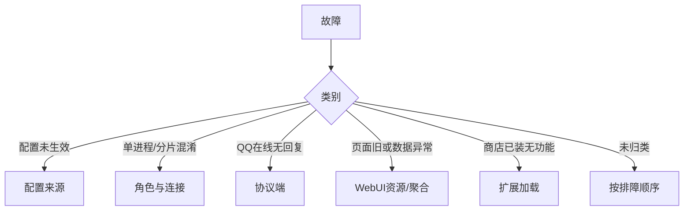

# 排障

排查顺序：部署形态 → 配置来源 → 角色与连接 → 日志 → WebUI 聚合。运行时问题多归入：配置未生效、角色判断错误、协议端连接错误、WebUI 资源或聚合异常、扩展未加载。

## 问题分类索引

## 排障顺序

1. 确认部署形态（单进程 / 分片；源码 / Docker / 混合）
2. 确认配置来源与覆盖关系
3. 确认运行角色与连接路径
4. 查看对应日志
5. 核对 WebUI 聚合状态与插件状态

## 1. 部署形态

| 问题 | 记录项 |
| --- | --- |
| 进程模型 | 单进程或分片（hub + worker） |
| 部署方式 | 源码、`docker compose`、混合目录 |
| 故障层 | core、官方插件、协议端、WebUI |

部署形态未确认前，后续日志与端口判断无效。

## 2. 配置来源

合并优先级（低 → 高）：

1. `config/pallas.toml`
2. 遗留 `.env`
3. `data/pallas_config/webui.json`（WebUI 落盘覆盖同名键）

| 现象 | 原因 |
| --- | --- |
| 修改 `pallas.toml` 不生效 | 同名键被 `webui.json` 覆盖 |

## 3. 角色与连接

### 单进程

- Bot 是否成功启动
- 协议端是否连到当前进程
- 扩展是否在当前进程加载

### 分片

- 故障在 hub 还是 worker
- 协议端是否连到目标 worker
- Redis 是否可达
- hub 聚合的 worker 状态是否正常

分片默认日志（优先于单进程日志）：

- `data/pallas_shard/logs/hub.log`
- `data/pallas_shard/logs/worker-*.log`

## 4. 按现象查日志

### WebUI 页面旧或与源码不一致

- `data/pb_webui/public/` 是否为当前版本产物
- 浏览器缓存
- 修改的是否为 Pallas-Bot-WebUI 源码仓（与运行产物不同）

### 协议端连不上

- 协议端实例 `ws_url`
- 分片下 `registry.json` 端口映射
- 目标 worker 是否在监听对应端口

### 扩展已装无反应

- 是否已重启
- 是否安装到当前运行环境
- `local/plugins/` 同名覆盖
- 分片下是否只查了 hub、未查 worker

### AI 任务无回执

- AI callback 是否到达 hub
- hub 是否路由到目标 worker
- 目标 worker 是否在线
- 参见 [LLM 与 AI](llm-and-ai.md)

### 命令权限或 cooldown 异常

- 代码默认值
- WebUI 命令权限覆盖
- 分片下 hub 聚合的 worker 插件元数据是否完整

## 关键路径

| 类型 | 路径 |
| --- | --- |
| 配置 | `config/pallas.toml`、`data/pallas_config/webui.json` |
| 单进程日志 | 当前 Bot 进程 stdout / 配置的日志输出 |
| 分片日志 | `data/pallas_shard/logs/hub.log`、`worker-*.log` |
| 分片状态 | `data/pallas_shard/registry.json`、`stats/worker-*.json` |
| WebUI 资源 | `data/pb_webui/public/` |

## 现象速查

| 现象 | 第一判断 |
| --- | --- |
| 页面未更新 | 资源同步或浏览器缓存 |
| 页面可开、数据错 | API 契约或 worker 聚合 |
| QQ 在线无回复 | 协议端连接、worker 日志、Redis |
| 商店已安装无功能 | 未重启或加载路径冲突 |
| 单 Bot 或单群异常 | 定位对应 worker，勿全局扫描 |

## 无效操作

- 分片故障优先查单进程日志
- 将 WebUI 源码仓与主仓运行产物视为同一目录
- 仅凭「命令匹配」判定执行成功
- 页面缺数据即假定前端 bug（常见为 worker 元数据未聚合）

## 专题文档

| 主题 | 文档 |
| --- | --- |
| 协议端与账号 | [协议端](/maintainer/install/protocol) |
| 分片连接 | [分片部署](/maintainer/deploy/sharded) |
| WebUI 资源 | [WebUI](/maintainer/install/webui) |
| 环境问题 | [FAQ](/deploy/faq) |
| AI / 闲聊 | [LLM 与 AI](llm-and-ai.md) |
