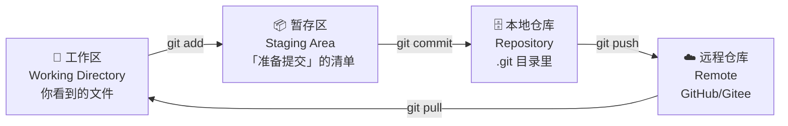
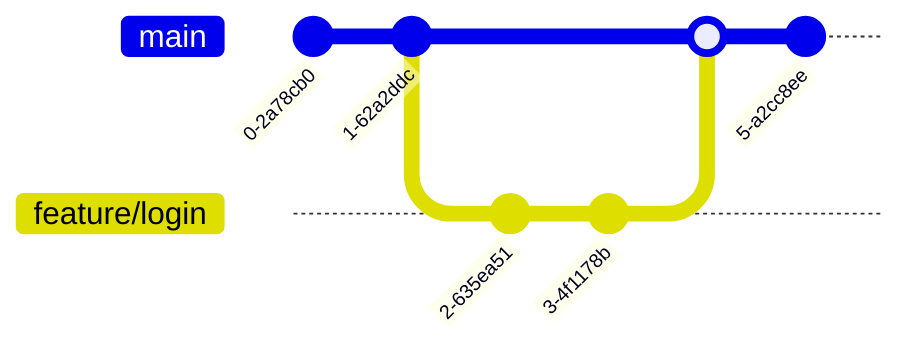
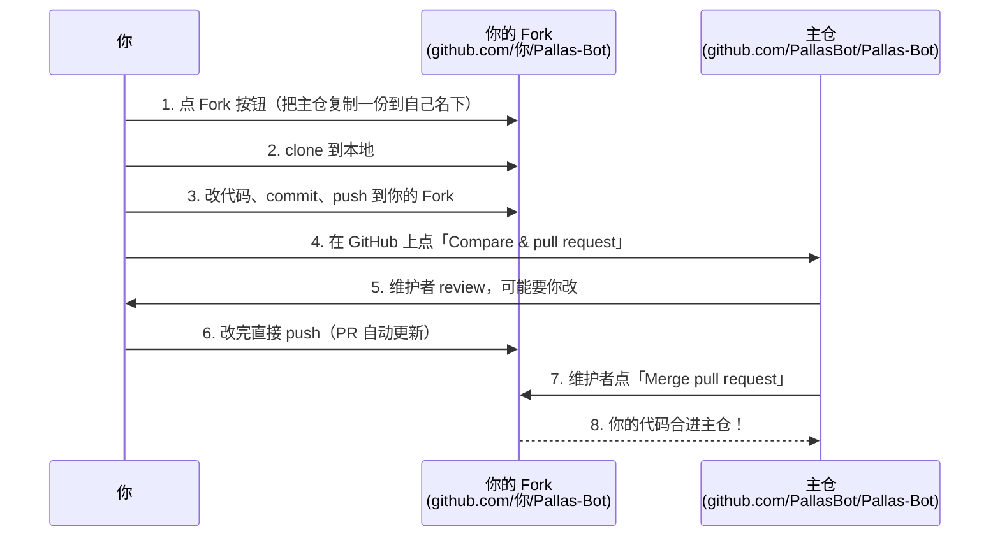

# 写代码不会 Git？等于是「用 Word 写论文但不用 Ctrl+Z」

写代码必学的「协作 + 版本管理」工具就是它 —— 不会 Git，你连给 Pallas-Bot 提 PR 都做不到，更别说本地折腾插件代码了。

> 读完这一页你能做到……  
> - [ ] 装上 Git、跑通 `git --version`、配好 `user.name` / `user.email`  
> - [ ] 听懂别人说的 `add` / `commit` / `push` / `merge` 是什么  
> - [ ] 自己独立 clone 项目、修改、提交、推送到 GitHub  
> - [ ] 知道「代码炸了」的时候怎么用 Git 救回来  
> - [ ] 知道「协同开发」时分支（branch）和 PR 是什么东西  

---

## 一、Git 到底是啥？先给它下个定义

> **Git = 一个「时光机 + 协作白板」**  
> - **时光机**：你写的每一行代码都被它「存档」，随时可以回退到任意时刻  
> - **协作白板**：你和小伙伴能**在同一个项目上同时改代码**，最后 Git 会帮你「合并」大家的工作

::: tip 🤔 类比一下
- 没有 Git → 你写代码改坏了 → 只能 `Ctrl+Z`（最多几十步）或者「final_final_真的最终版.zip」
- 有了 Git → 你写代码改坏了 → 一行命令 `git reset --hard xxx` → 回到任意历史时刻
- 没有 Git 协作 → 你改你的，他改他的，最后用 U 盘/微信互相传文件（真实血泪史）
- 有了 Git 协作 → 你 push 你的，他 push 他的，GitHub 帮你「合二为一」，冲突了再人工修
:::

> **Git ≠ GitHub**  
> **Git** 是装在你电脑上的「版本管理工具」（本地软件）。  
> **GitHub / Gitee / GitLab** 是「帮你存放代码 + 协同」的网站（云端服务）。  
> 类比：Git 是 Word，GitHub 是「腾讯文档」（Word 可以离线用，腾讯文档要联网协同）。

---

## 二、Git 的「三大区」—— 萌新最容易懵的地方

**这是 Git 里最最最核心的概念**。所有命令都围着这三个区转：



| 区 | 中文 | 它是什么 | 关键命令 |
| :--- | :--- | :--- | :--- |
| **Working Directory** | 工作区 | 你**眼睛看得到**的文件，就是你的项目文件夹 | 编辑文件 |
| **Staging Area** | 暂存区 | 「**下次提交要打包哪些文件**」的清单 | `git add` / `git restore --staged` |
| **Repository** | 本地仓库 | `.git` 目录里记录的**历史快照** | `git commit` |
| **Remote** | 远程仓库 | 放在 GitHub / Gitee 上的副本 | `git push` / `git pull` / `git fetch` |

> **萌新常见困惑：「为啥要分『暂存区』？直接 commit 不行吗？」**  
> 设想你改了两个文件：  
> - `bug_fix.py` —— 修好了一个 bug ✅（这次想提交）  
> - `secret_password.txt` —— 不小心加进来的密码文件 ❌（这次不能提交）  
>   
> **没有暂存区** → 你要么全提交（密码泄露），要么都不提交（bug 修不了）  
> **有了暂存区** → 你只 `git add bug_fix.py` → 然后 `commit` → 干净！  
>   
> **暂存区 = 「这次打包选哪些」的购物车** 🛒

---

## 三、装上 Git + 第一次配置

Git 用之前要先「装上 + 自报家门」两件事，**这一节一次搞定**。

### 3.1 先装上 Git

按你的系统挑一个：

**Debian / Ubuntu（apt 一把梭，最常见）**

```bash
sudo apt update
sudo apt install git -y
git --version    # 看到 git version 2.3x.x / 2.4x.x 就 OK
```

**其他 Linux 速查**

| 发行版 | 命令 |
| :--- | :--- |
| CentOS / RHEL / Fedora | `sudo dnf install git -y` |
| Arch / Manjaro | `sudo pacman -S git` |
| openSUSE | `sudo zypper install git` |
| Alpine | `apk add git` |

**Windows（最推荐 winget，Win10/11 自带）**

```powershell
# 方法 A（推荐）：用「管理员身份」打开 PowerShell 跑
winget install --id Git.Git -e --source winget

# 方法 B：去官网下安装包
# https://git-scm.com/download/win → 64-bit Git for Windows Setup
# 全程 Next 默认即可（自带 Git Bash + GUI）
```

**macOS**

```bash
brew install git                # 装了 Homebrew 的话
xcode-select --install          # 没装 Homebrew，装 Xcode 命令行工具
```

装完在终端跑一下 `git --version`，能输出版本号就是装好了。

### 3.2 自报家门：配置 `user.name` / `user.email`

**任何人第一次用都得告诉 Git「你是谁」** —— 这两条信息会写进你**每一次 commit**：

```bash
# === 必做：配置身份 ===
git config --global user.name  "你的昵称"        # 比如 aknyzsd
git config --global user.email "你的邮箱@example.com"  # 用 GitHub 注册邮箱最稳

# === 推荐：配置默认编辑器 + 默认分支名 ===
git config --global core.editor "code --wait"   # VSCode 当默认编辑器（不配默认是 vim，小白劝退）
git config --global init.defaultBranch main     # 新仓库默认主分支叫 main（GitHub 现在的约定）

# 跑一眼自己配了啥
git config --list
# 配置文件存在：~/.gitconfig（Linux/Mac）或 C:\Users\你\.gitconfig（Windows）
```

::: warning 🚨 邮箱要不要用真实的？
- 如果你**只本地玩** → 随便填  
- 如果你要**推 GitHub** → 强烈建议填 GitHub 注册邮箱（不然 GitHub 上 commit 会显示「未验证」灰色头像）  
- 如果你要**保护隐私** → GitHub 设置里有「noreply 邮箱」（`12345+aknyzsd@users.noreply.github.com`），用这个就好
:::

---

## 四、上手！最常用的 8 条命令

我们用一个真实场景串起来——「本地新建一个项目 → 改点东西 → 提交」：

### 🎬 场景 A：完全从零开始

```bash
# 1. 创建一个新文件夹（你的项目）
mkdir my-first-repo
cd my-first-repo

# 2. 初始化 Git 仓库（这一步会创建隐藏的 .git 目录）
git init
# 输出：Initialized empty Git repository in /xxx/my-first-repo/.git/

# 3. 写点东西（比如新建 README.md）
echo "# 我的第一个 Git 仓库" > README.md

# 4. 看一眼当前状态（Git 告诉你：我发现了一个新文件）
git status
# 输出：Untracked files: README.md   ← 这个文件还没被 Git 管

# 5. 把 README.md 加到「暂存区」
git add README.md
# 再次 git status 会看到：Changes to be committed: new file: README.md

# 6. 提交！写一条说明「这次改了啥」
git commit -m "第一次提交：加了个 README"
# 输出：1 file changed, 1 insertion(+)

# 7. 看一眼历史
git log
# 输出：commit a1b2c3d4 (HEAD -> main) ...  ← 后面那一串是 commit ID（哈希）
#       Author: 你的昵称 <你的邮箱>
#       Date:   ...
#       第一次提交：加了个 README
```

> 提交完这一步，**你的代码就有「历史记录」了** —— 以后改坏任何东西都能回退到这个时刻。

### 🎬 场景 B：clone 一个已有项目（最常用！）

```bash
# 1. 复制远程仓库到本地
git clone https://github.com/PallasBot/Pallas-Bot.git
cd Pallas-Bot

# 2. 远程默认地址叫 origin，可以看一眼
git remote -v
# origin  https://github.com/PallasBot/Pallas-Bot.git (fetch)
# origin  https://github.com/PallasBot/Pallas-Bot.git (push)

# 3. 改点东西（比如改个文件）
echo "我改了点东西" >> README.md

# 4. 提交到本地仓库
git add README.md
git commit -m "docs: 改了点东西"

# 5. 推送到 GitHub（让远程也有你的修改）
git push origin main
# 第一次 push 可能要你输 GitHub 用户名/密码（现在多用 Personal Access Token）
```

### 🎬 场景 C：同步远程的最新改动（团队协作必会）

```bash
# 拉取远程最新的 commit 合并到本地（= fetch + merge）
git pull origin main

# 如果你想先看看「远程有啥新东西」再决定合不合
git fetch origin
git log origin/main   # 看远程的 log
```

### 🎬 速查表：8 条最常用命令

| 命令 | 它干嘛的 | 萌新最常见的坑 |
| :--- | :--- | :--- |
| `git init` | 把当前目录变成 Git 仓库（生成 `.git`） | **不要在 `/` 或 `C:\` 下 `init`**（会扫遍全盘） |
| `git clone <url>` | 把远程仓库复制到本地 | 复制完一定要 `cd` 进去再操作 |
| `git status` | 看「工作区/暂存区」当前状态 | 提交前**必跑一眼**，能救命 |
| `git add <文件>` | 把文件丢进「暂存区」 | `git add .` 一次性 add 所有（**慎用，注意 `.gitignore`**） |
| `git commit -m "说明"` | 把暂存区打包成一次「历史快照」 | **说明别写"update"**（一个月后你自己看不懂） |
| `git log` | 看提交历史（`q` 退出） | 想看一行：`git log --oneline` |
| `git push` | 把本地 commit 推到远程 | 第一次 push 要写 `git push -u origin main` 绑定上游 |
| `git pull` | 把远程最新代码拉下来合并到本地 | **push 前先 pull** 能少 90% 冲突 |

---

## 五、分支（Branch）—— 团队协作的灵魂

> **一句话讲清分支**：「你能在不破坏主代码的情况下，开一条『平行宇宙』随便折腾，折腾完再合并回来」



### 5.1 为什么要用分支？

设想你在 `main`（主分支）上**直接改**代码：
- 改到一半，产品经理说「这个功能先别上」 → 你卡住了，要么撤销（白干）要么硬上（背锅）
- 改到一半，线上突然出 bug → 你不敢动 main，因为你的半成品代码也在里面

**有了分支**：
- 你从 `main` 开一条新分支 `feature/login` → 在这条分支上随便改
- 改完了 → 提个 PR（合并请求）→ 同事 review → 合并回 `main`
- 中途线上出 bug → 你切回 `main` → 另开一条 `hotfix/xxx` → 修完合并 → 不影响你那个改一半的 feature

### 5.2 分支常用命令

```bash
# 1. 看所有分支（前面带 * 的是「当前所在的」）
git branch
# * main

# 2. 新建分支（注意：新建完还在原分支上）
git branch feature/login

# 3. 切换到新分支
git checkout feature/login
# 上面两步可以合成一步：git checkout -b feature/login

# 4. 在新分支上改东西 → add → commit（和之前一样）
echo "新增登录功能" > login.py
git add login.py
git commit -m "feat: 新增登录功能"

# 5. 合并回 main（先切回 main，再 merge）
git checkout main
git merge feature/login
# Git 会自动做「快进合并」（Fast-forward）：把 main 指针直接挪到 feature 的最新 commit

# 6. 合并完可以删掉这个 feature 分支
git branch -d feature/login
```

### 5.3 冲突了怎么办？（Conflict）

两个人**改了同一个文件的同一行**，merge 就会冲突。**别慌，Git 会标出来让你手动选**：

```bash
# Git 会把冲突部分标成这样：
# <<<<<<< HEAD
# 你的版本
# =======
# 别人的版本
# >>>>>>> feature/other

# 手动改文件：
# 1. 打开文件
# 2. 看清楚 HEAD 和 feature 两边都写了啥
# 3. 删掉 <<<<<<< ======= >>>>>>> 这些标记
# 4. 留下你最终想要的内容（可能两者都要、可能只要一边、可能重写）
# 5. 保存
# 6. git add 这个文件
# 7. git commit（不用写 -m，Git 会自动给个 merge message，你也可以重写）
```

> **冲突不是 bug，是 Git 在求你做决定**。解决冲突的最好工具：VSCode（左中右三栏比对，点几下就解决）。  
> 命令行下也能用 `git mergetool`，但 VSCode 更香~

---

## 六、远程协作：Fork + Pull Request 流程

**给开源项目（比如 Pallas-Bot）提代码的标准姿势**：



### 6.1 为啥不直接 clone 主仓？

因为**你通常没有主仓的写权限**。所以：

1. **Fork** → 在 GitHub 上点 Fork 按钮，把主仓「复制」一份到你自己的 GitHub 账户下
2. **clone 你自己的 Fork** → `git clone https://github.com/你的用户名/Pallas-Bot.git`
3. **改代码 → push 到你的 Fork**
4. **在 GitHub 上点「Contribute → Open pull request」** → 发起 PR
5. 维护者 review → 可能要你改 → 你 push 后 PR 自动更新
6. 维护者点 Merge → 你的代码进主仓！

### 6.2 让本地「同时知道」你的 Fork 和主仓

```bash
# 假设你 clone 的是自己的 Fork（默认 remote 叫 origin）
git remote -v
# origin  https://github.com/你的用户名/Pallas-Bot.git   ← 你的 Fork

# 加上主仓作为「另一个 remote」，方便同步主仓最新代码
git remote add upstream https://github.com/PallasBot/Pallas-Bot.git
git remote -v
# origin    https://github.com/你的用户名/Pallas-Bot.git
# upstream  https://github.com/PallasBot/Pallas-Bot.git

# 同步主仓最新代码到本地（先 fetch upstream，再 merge 到你的分支）
git fetch upstream
git checkout main
git merge upstream/main
```

> **关于 Pallas-Bot 的 PR 流程更详细的看 →** [贡献流程](/develop/workflow)  
> **关于 SSH 免密推送 →** 配 SSH Key 比每次输 token 爽 100 倍，看 [「用 SSH 连 GitHub」](#九ssh-免密推送可选-但强烈推荐) 这一节的步骤

---

## 七、后悔药：改错了怎么救？

**Git 的核心哲学：几乎所有「后悔」都能救**。关键是你得知道用哪条命令：

| 你干了啥蠢事 | 后悔药命令 | 危险度 |
| :--- | :--- | :--- |
| 工作区文件**还没 add**，改坏了 | `git checkout -- 文件名` 或 `git restore 文件名` | ⭐ 安全 |
| **已经 add** 但还没 commit，想撤出暂存区 | `git restore --staged 文件名` | ⭐ 安全 |
| **已经 commit**，但还没 push，想「撤销这次 commit 但保留改动」 | `git reset --soft HEAD~1` | ⭐⭐ 小心 |
| 已经 commit，想「**彻底**回到上一次 commit 的样子（改动全丢）」 | `git reset --hard HEAD~1` | ⭐⭐⭐⭐ **危险！改动全没了** |
| 已经 push 到远程了，commit message 写错了 | `git commit --amend -m "新说明"` 然后 `git push --force`（**force push 慎用！**） | ⭐⭐⭐ |
| 已经 push 到远程了，想「**新建一个 commit 撤销它**」（推荐做法） | `git revert <commit-id>` | ⭐ 安全 |
| 改到一半突然要切分支，但当前改动不想 commit | `git stash` 暂存起来，切完分支再 `git stash pop` | ⭐ 安全 |
| **任何操作后** 想知道「我刚才到底动了啥」 | `git reflog` —— **Git 的黑匣子** | ⭐⭐ 救命神技 |

### 🆘 `git reflog` —— 真正的「万能后悔药」

`git log` 只看「当前分支的历史」。  
`git reflog` 看「**HEAD 指针的所有移动记录**」—— 哪怕你 `reset --hard` 把代码删光了，**只要 reflog 里还有记录，你就能找回来**：

```bash
git reflog
# a1b2c3d HEAD@{0}: reset: moving to HEAD~1   ← 你刚才 reset 了
# f4e5d6c HEAD@{1}: commit: 我手贱的提交         ← 这就是你想找回的那个 commit

git reset --hard f4e5d6c    # 回去！代码回来啦
```

> **reflog 90 天内的记录都在**（默认 90 天过期），所以只要不是几个月前手贱，基本都能找回来。  
> **唯一的例外**：如果 commit 后跑过 `git gc`（垃圾回收），reflog 也可能没了。但普通人不会主动跑这个。

---

## 八、`.gitignore` —— 啥不该让 Git 管

**这是个文本文件**，里面写的「规则」会让 Git 跳过这些文件/文件夹（不 add、不 push）。

在项目**根目录**新建一个 `.gitignore` 文件，写规则：

```gitignore
# 注释以 # 开头

# === 操作系统自动生成的文件 ===
.DS_Store              # macOS
Thumbs.db              # Windows

# === 编辑器/IDE ===
.vscode/               # VSCode 配置（除非你故意要共享）
.idea/                 # JetBrains 系列
*.swp                  # Vim 临时文件

# === Python 常见忽略 ===
__pycache__/
*.py[cod]
*.egg-info/
.venv/
venv/

# === Node.js 常见忽略 ===
node_modules/
dist/
.vitepress/dist/
.vitepress/cache/

# === 敏感信息（千万千万千万别 commit 上去！）===
.env
*.key
*.pem
config.local.toml
```

> **想看更全的模板？** → [github/gitignore 官方仓库](https://github.com/github/gitignore)（各种语言/框架都有现成模板，复制粘贴就行）  
> **想检查「我有没有把不该传的传上去」** → 装个 [gitleaks](https://github.com/gitleaks/gitleaks) 工具，提交前扫一遍

::: danger 🚨 真·事故案例
很多萌新不小心把 `.env`（里面是 API Key / 数据库密码）commit 并 push 到 GitHub 的**公开仓库** ——  
**哪怕你几分钟后立刻删 commit，Git 历史里依然有（用 `git log -p` 能翻出来）**。  
- 正确做法：**发现的第一时间** → `git filter-repo` 或 BFG 重写历史 → **立刻去密钥管理后台作废旧 key**（别心存侥幸）  
- 预防：项目初始化时就加 `.gitignore` + 用 `git status` 二次确认 + **永远不在配置文件里写真实密钥**（用环境变量 / 占位符 `YOUR_API_KEY`）  
:::

---

## 九、SSH 免密推送（可选，但强烈推荐）

每次 `git push` 都要输用户名密码 / token？**配个 SSH Key 就再也不用输了**：

```bash
# 1. 生成 SSH Key（一路回车用默认就行）
ssh-keygen -t ed25519 -C "你的邮箱@example.com"
# 生成的文件：
#   ~/.ssh/id_ed25519       ← 私钥（千万别给别人！放自己电脑！）
#   ~/.ssh/id_ed25519.pub   ← 公钥（要传到 GitHub）

# 2. 复制公钥内容
cat ~/.ssh/id_ed25519.pub
# 全选复制那段 ssh-ed25519 AAAAC3Nza... 你的邮箱

# 3. 去 GitHub → Settings → SSH and GPG keys → New SSH key
#    粘贴进去，Title 随便起（比如 "我的笔记本"），点 Add

# 4. 测试一下
ssh -T git@github.com
# 看到：Hi 你的用户名! You've successfully authenticated... 就 OK

# 5. 以后 clone 的时候用 SSH 链接（不是 https！）
git clone git@github.com:PallasBot/Pallas-Bot.git
# 这样 push 就不用输密码了
```

> **Windows 用户注意**：  
> - Win10/11 自带 OpenSSH，先在 PowerShell 跑 `ssh` 看有没有；没有就在「设置 → 应用 → 可选功能」里装  
> - 私钥路径一般是 `C:\Users\你\.ssh\id_ed25519`（不是 `~/.ssh/`）  
> - 想图形化管理 SSH Key？装个 [GitHub Desktop](https://desktop.github.com/) 自动帮你搞定

---

## 十、Git 实战：给 Pallas-Bot 提个 PR 走一遍

> **场景**：你发现 Pallas-Bot 的文档里有个错别字，想改一下顺便体验 PR 流程

```bash
# === 1. Fork + clone ===
# 在 GitHub 上点 PallasBot/Pallas-Bot 的 Fork 按钮
git clone git@github.com:你的用户名/Pallas-Bot-Docs.git
cd Pallas-Bot-Docs

# === 2. 加 remote（可选，方便同步主仓） ===
git remote add upstream https://github.com/PallasBot/Pallas-Bot-Docs.git
git fetch upstream

# === 3. 拉一条新分支（不要在 main 上直接改！） ===
git checkout -b fix/typo-readme

# === 4. 改文件 ===
# 用编辑器打开 src/.../index.md，改个错别字，保存

# === 5. 检查改了啥 ===
git status
git diff
# diff 会显示「- 错误的字」 「+ 正确的字」

# === 6. add + commit ===
git add src/.../index.md
git commit -m "docs: 修正 README 错别字"

# === 7. push 到你的 Fork ===
git push origin fix/typo-readme
# 第一次 push 这个分支要写 -u：git push -u origin fix/typo-readme

# === 8. 去 GitHub，会自动弹出「Compare & pull request」按钮
#    点进去 → 写 PR 标题和说明 → 点 Create pull request
#    等维护者 review → 通过后合并 → 你的名字会出现在 Contributors 列表里
```

> **commit message 怎么写？** 跟着 [Conventional Commits](https://www.conventionalcommits.org/zh-hans/) 走最稳：  
> - `feat: 新增了 XX 功能`  
> - `fix: 修复了 XX bug`  
> - `docs: 改了文档`  
> - `refactor: 重构了 XX`  
> - `chore: 杂事（依赖更新、配置文件调整）`  
>   
> Pallas-Bot 项目里也会用这些前缀，照葫芦画瓢就行~

---

## 十一、再深一点：几个「听起来很酷」的进阶概念

| 概念 | 一句话讲清 | 啥时候用 |
| :--- | :--- | :--- |
| **`git rebase`** | 「**改写** commit 历史」（合并多个 commit、调整顺序） | 准备 PR 前，把你的 N 个 commit 整理成 1-2 个干净的 |
| **`git cherry-pick <id>`** | 「**挑一个**特定 commit 应用到当前分支」 | 修了 bug 要同步到多个分支时 |
| **`git tag`** | 给某个 commit 起个「版本号」（v1.0.0） | 发版本时打 tag |
| **`git submodule`** | 一个仓库里**嵌套**另一个仓库（独立管理） | 公共库 / 第三方组件 |
| **`git worktree`** | 同一个仓库**同时**在多个文件夹里工作（不同分支） | 想同时改两个分支对比测试时 |
| **`git bisect`** | 用「**二分查找**」定位「哪个 commit 引入的 bug」 | 排查「N 天前还正常，从哪次 commit 开始挂的」 |
| **Git LFS** | 用 Git 管「大文件」（图片/视频/模型权重） | 仓库里要传几百 MB 的模型文件时 |

> **萌新阶段不用急着学这些**。先把前面 4-7 节玩熟，进阶的用到时再查 `git <命令> --help` 或者搜博客。

---

## 十二、推荐学习资源

- **官方文档（最权威）**：[Pro Git 中文版](https://git-scm.com/book/zh/v2) —— 免费电子书，写得非常清楚
- **可视化练习**：[Learn Git Branching](https://learngitbranching.js.org/?locale=zh_CN) —— 用关卡 + 动图理解分支，超好玩
- **常见错误速查**：[Oh Shit, Git!?!](https://ohshitgit.com/)（[中文翻译](https://ohshitgit.com/zh)）—— 名字很野，但内容很救命：「我 commit 错了怎么办」「我把代码搞没了怎么救」
- **交互式速成**：[阮一峰 Git 教程](https://www.ruanyifeng.com/blog/2015/12/git-cheat-sheet.html) —— 简明清晰，一小时入门
- **VSCode 用户福利**：VSCode 自带 Git 图形界面（左侧源代码管理面板），鼠标点点也能完成 80% 的日常操作，新手可以「命令行 + 图形」混着用，慢慢过渡

---

## 十三、常见误区 & 急救

::: warning ❌ 萌新最容易踩的坑
1. **在错误目录 `git init`**  
   `git init` 会生成 `.git` 隐藏目录，**不要在 `/`、C 盘根目录、家目录**等地方跑。**永远在「项目文件夹」里 init**。

2. **`git add .` 啥都加进去了**  
   句点意思是「当前目录所有文件」。如果 .gitignore 没配好，会把 `.env`、`node_modules` 这种也加进去。  
   **建议**：用 `git add <具体文件>` 一个一个加；或者 `git add .` 前先 `git status` 看一眼。

3. **commit message 写得太敷衍**  
   ❌ `update`、`fix`、`改了点东西`  
   ✅ `feat: 新增用户登录接口`、`fix: 修复配置文件读取空值崩溃`  
   一个月后翻历史，敷衍 message = 完全看不懂自己当时改了什么。

4. **直接在 main 上改代码**  
   主分支是「最稳的代码」，**不要直接在 main 上改**。  
   永远 `git checkout -b feat/xxx` 开分支 → 改完 → PR 合并。

5. **`git push --force`（强制推送）**  
   `--force` 会**直接覆盖远程历史**，如果别人已经基于你的旧 commit 工作了，他会被你「清空历史」炸到。  
   **真要 force**，用 `git push --force-with-lease`（更安全，会先检查远程有没有别人推过新东西）。

6. **commit 了敏感信息**  
   立刻「作废旧密钥 + 用 `git filter-repo` 重写历史 + 通知安全团队」。**别想着「反正没人看」**——GitHub 有专门的「敏感信息扫描」，而且你的 commit 会永远留在每个 fork 者的本地仓库。
:::

---

## 走完这页你能做到…… ✅

- [ ] 能用「**三大区**」解释 Git 的工作流
- [ ] 装好 Git、配好了 `user.name` / `user.email`（**第一次用必做**）
- [ ] 会用 `init` / `clone` / `add` / `commit` / `push` / `pull` 这 6 条基础命令
- [ ] 懂「**分支**」是什么，知道为啥不要直接在 main 上改
- [ ] 知道「**冲突**」长啥样、怎么解决
- [ ] 知道「**改坏了**」怎么用 `reset` / `revert` / `reflog` 救
- [ ] 写过 `.gitignore` 并理解「**敏感信息绝不能 commit**」
- [ ] （可选）配了 **SSH Key**，告别每次 push 输密码
- [ ] 知道给 Pallas-Bot 提 PR 的标准流程（Fork → 分支 → 改 → push → PR）

---

下一步 → 看看 [Linux 速成 6 篇](/noobook/advance/linux/install)（**机器人部署在 Linux 上最稳**），  
或者直接去 [你过关!](/noobook/welldone) 收个尾 →  或者回到 [萌新引导首页](/noobook) 复习别的内容~
