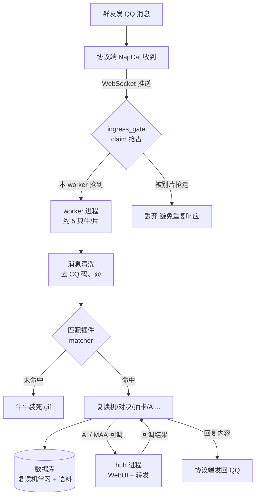
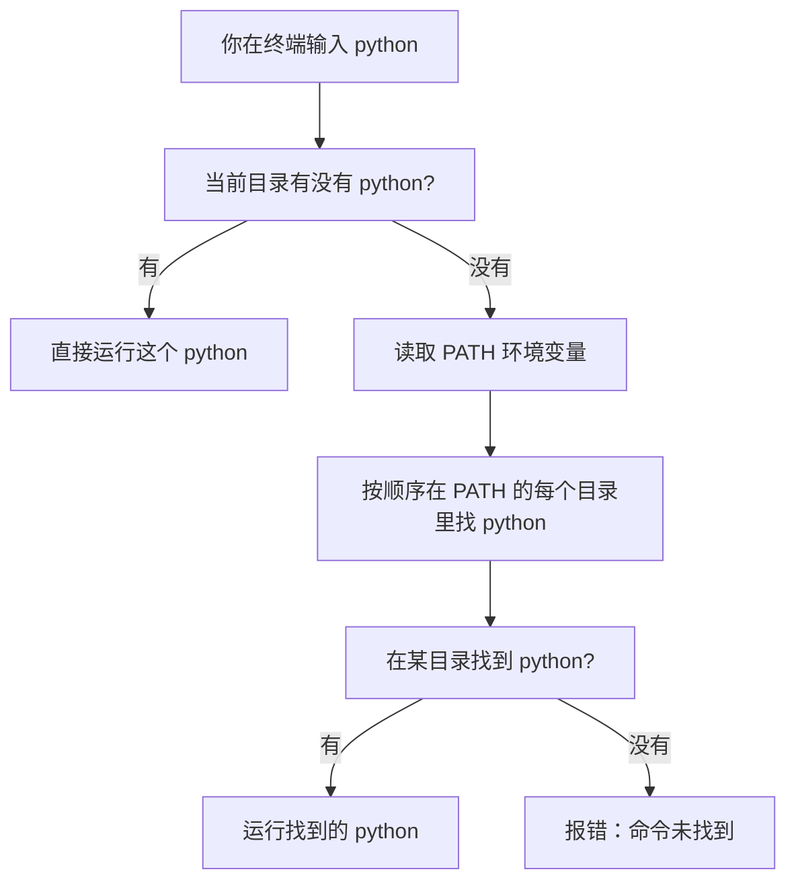

# 在这里，你可能需要先明白一些浅显的概念
## 作为服务器运行
无论你使用何种系统，必须保证系统内程序一直运行才能保证牛牛的存活。

换句话来说，你需要一台能一直运行的电脑/云服务器(按理来说手机或者开发板也行，但是你要是会用这些为什么你会来这里?)
## bot的工作流程是什么？



简单扫一眼就懂啦~ 重点看中间那俩菱形「ingress_gate claim 抢占」和「匹配插件 matcher」：

- **claim 抢占**：你只跑一只牛（单 worker）时，这个菱形永远走左边「本 worker 抢到」分支，右边的「丢弃」分支只在 **多 worker / 多牛分片** 时才会出现。萌新前期可以先无视它~
- **匹配插件 matcher**：bot 内部其实是一大堆插件（复读机、对决、抽卡、AI 画画……），matcher 就像个总指挥，看看你这条消息喊的是哪个插件的口令，喊中了才进处理；没喊中任何口令就直接 `牛牛装死.gif` 啦。
- **hub 进程**：别被它吓到，hub 其实就是个「管事房」——平时只管 WebUI、协议端账号、AI/MAA 回调转发，并不直接接牛牛的反向 WebSocket（真正的「接话」在 worker 那边）。想深入了解可以戳 [多进程分片](/architecture/bot-process-sharding)。
## 路径
想象一下，你的电脑是一个超级巨大的“寻宝仓库”，里面有一排排的抽屉（文件夹），抽屉里套着小抽屉，最深处藏着各种宝贝（文件）。<br>
“路径”，就是你给快递小哥写的“寻宝路线图”！<br>
如果没有路径，电脑就会像个无头苍蝇：“你要找猫猫.jpg？我仓库里有几万个叫猫猫的，你到底要哪个？！”<br>
有了路径，电脑就能一秒寻宝：“哦！从大门进去→打开‘生活’抽屉→打开‘照片’小抽屉→拿走‘猫猫.jpg’！”<br>

### 指路的时候，通常有两种指法：
绝对路径（全宇宙唯一地址）：如:/config/pallas.example.toml<br>
就像写快递地址一样，从国家、省、市、区一路写下去，不管你现在站在哪儿，按这个地址绝对能找到。如：/宇宙/地球/中国/你家/卧室/床底/袜子<br>
相对路径（只看眼前的路标）：如:/opt/Pallas-Bot/config/pallas.example.toml<br>
就像你已经在卧室了，直接说“去床底找袜子”就行，不用再把“宇宙/地球”报一遍，主打一个偷懒。<br>

### 注意，同样是路径，Windows 和 Linux 两个性格完全不同，画风差距极大：
1. 起点的执念：一棵树 vs 多个岛<br>
Linux 是个“森林守护者”：在 Linux 眼里，全世界只有一棵倒着长的大树。不管你插了多少块硬盘、U盘，所有东西都必须挂在这棵树上。它的起点永远只有一个，叫作根目录，用 / 表示。所有的路线都从 / 开始，非常专一！<br>
Windows 是个“群岛地主”：Windows 觉得分区就是分地盘，每个盘符（C盘、D盘、E盘）都是一座独立的岛屿。所以它的路线起点有无数个：C:\、D:\、E:\，主打一个占山为王。(所以装win系统分区的时候不要一分分一堆)<br>
2. 走路的姿势：溜冰鞋 vs 贴墙走<br>
Linux 喜欢“向前滑”：层与层之间，Linux 用的是正斜杠 /。看起来就像一个人在溜冰，嗖嗖嗖一路向前，特别清爽。如：/home/user/cat.jpg<br>
Windows 喜欢“靠右倒”：层与层之间，Windows 用的是反斜杠 \。看起来就像一个人贴着墙根往后倒，一不小心还容易跟旁边的字母搞混（比如 \n 换行符大乱斗）。如：C:\Users\小明\cat.jpg<br>
3. 脸盲症 vs 强迫症：大小写的态度<br>
Windows 有点“脸盲”：它觉得 Cat.jpg、cat.jpg、CAT.JPG 都是同一只猫！你随便怎么大小写，它都认得，主打一个包容。<br>
Linux 是重度“强迫症”：在它眼里，大写就是大写，小写就是小写！Cat.jpg 和 cat.jpg 是两只完全不同的猫！如果你把大小写打错，Linux 会冷酷地把门一关：“查无此猫，告辞！”<br>
## IP和域名
### IP + 端口 = 找到特定的猪圈食槽
互联网这个大农场里有成千上万个猪圈，每个猪圈里还有好几个不同用途的坑位。<br>
IP地址：就是猪圈的门牌号。它决定了大部队走到哪个圈。<br>
端口：就是猪圈里的具体哪个食槽/小窗户。比如 80号窗口专门发西瓜(默认http)，80号窗口专门发苹果，22号窗口是管理员的专属通道(ssh)。<br>
如果只给IP，别人只能找到你的猪圈，但在门口干着急不知道往哪递东西；必须要有 IP:端口，比如 192.168.1.5:8080，别人才知道：“哦！去5号圈，找8080号窗递数据包！”<br>
### 小猪必须认识的几个VIP地址
调试项目的时候，你天天都要和这几个特殊门牌号打交道，记住它们，你就不会迷路！<br>
1. 127.0.0.1 和 localhost —— 本地回环地址。<br>
这是小猪在自己的猪圈里照镜子！不管你的项目跑到哪台电脑上，只要在这台电脑上访问 127.0.0.1，就是在访问“我自己”。其他电脑不可访问(当然你可以通过转发来实现)<br>
调试场景：你把项目刚跑到服务器上，第一步就是在这台服务器上访问 127.0.0.1:端口，看看有没有反应。如果照镜子都看不到自己，说明项目根本没跑起来，别指望外面的小猪能看到了！<br>
*注：localhost 就是 127.0.0.1 的小名，两个喊的是一个猪。*<br>
2. 192.168.x.x —— 局域网IP / 内网IP（常见的还有 10.x.x.x 和 172.16-31.x.x）。<br>
这是只属于你们这一个猪圈的内部通道！同一个猪圈（连着同一个Wi-Fi/路由器）的小猪，可以通过这个地址互相串门。但是，猪圈外面互联网上的大灰狼，绝对进不来！<br>
调试场景：你在自己电脑上写代码，想用手机测试一下页面效果。只要手机和电脑连同一个Wi-Fi，你电脑的局域网IP是 192.168.1.10，手机浏览器输入 192.168.1.10:8080，就能看到你的项目啦！<br>
3. 0.0.0.0 —— 广播地址。<br>
小猪理解：当你启动项目时，如果绑定 0.0.0.0，就等于你打开了猪圈里所有的门：“不管你是从内部小路（192.168）来的，还是从挖地道直通猪圈（vpn）来的，只要找到我这个圈(本机)，哪个窗口我都接客！”<br>
调试场景：项目部署时非常重要！如果你绑定 127.0.0.1，那只有本机能访问；如果你绑定了0.0.0.0，那么将会监听你所有的地址。<br>
4. 公网IP（比如 114.114.114.114 这种奇葩数字） —— “全球定位门牌”<br>
这是互联网大农场总部分配的全球唯一门牌号。全世界任何角落的小猪，只要输入这个门牌号，都能找到你的猪圈。<br>
调试场景：当你把项目部署到云服务器（比如阿里云、腾讯云）上，人家给你的那个IP就是公网IP。外地的小猪输入 公网IP:端口，就能访问你的项目了。<br>
## shell操作界面(cmd)
### 什么是 Shell？（它就是翻译官！）
电脑的“大脑”叫**内核**，它只懂电信号（0和1），听不懂人类的字母。
如果小猪直接对电脑喊“帮我建个文件夹”，内核会一脸懵。
这时候就需要 **Shell（壳）** 出场了！
- 小猪在黑框框里敲键盘，说出人类的话（命令）。
- **Shell 就像站在内核外面的翻译官**，它把小猪的命令翻译成0和1给内核听。
- 内核干完活，Shell 再把结果翻译成小猪能看懂的文字，显示在屏幕上。
**简单记：Shell = 给小猪和电脑大脑当翻译的“壳”。**
- Windows 的壳，最经典的就是 **CMD**（命令提示符）。
- Linux 的壳，最常用的是 **Bash**（一般在叫“终端”的黑框框里）。

---

### Win 和 Linux 基础操作“翻译词典”

既然都是翻译官，干的活差不多，只是念的“咒语”不一样。给小猪列个小抄：

| 小猪想干嘛 | Windows 管家 (CMD) | Linux 魔法师 | 记忆小窍门 |
| :--- | :--- | :--- | :--- |
| **看房间里有啥** | `dir` | `ls` | **L**i**s**t（列出来） |
| **看文件写了啥** | `type` 文件名 | `cat` 文件名 | 像小猫🐱一样把内容“念”出来 |
| **建新文件夹** | `mkdir` | `mkdir` | 一模一样！ |
| **删文件** | `del` 文件名 | `rm` 文件名 | **R**e**m**ove（移除） |
| **清空黑框框** | `cls` | `clear` | Clear（清理干净） |
| **遇到不懂的咒语** | `命令 /?` | `man 命令` | Man...ual（说明书） |

---

### 给小猪提个醒：Linux 的两个“坑”

虽然两个世界很像，但 Linux 有两个特别的地方，小猪一定要知道：

1. **Linux 吃文件没有“后悔药”**
   - 在 Windows 里删东西，可能会进回收站，还能捡回来。
   - 在 Linux 里用 `rm` 删文件，是**直接扔进粉碎机**，永远没了！所以用 `rm` 一定要看清楚。

2. **Linux 有“门禁”**
   - Windows 小猪经常可以随便删东西。
   - Linux 是个守规矩的世界，有些重要的系统文件，小猪没资格动。如果小猪必须动，要在命令前面加 `sudo`（意思是“Super User DO”，相当于对系统说：**“借我用一下大人的权限！”**）。

---

> **总结给小猪的一句话：**
> Shell 就是你和电脑对话的翻译官，换了个系统就是换了个方言，`dir` 变成了 `ls`，`del` 变成了 `rm`，但在 Linux 里用 `rm` 一定要小心，没有回收站哦！
## 环境变量
省流：  
**环境变量 = 操作系统提前写好的一本“名字=值”小本本，所有程序都可以翻，用来知道：**  
- **去哪找可执行文件（PATH）**  
- **你是谁、你家在哪（USER/HOME）**  
- **当前语言/时区/编码（LANG、TZ）**  
- **各种配置开关和密钥（DB_HOST、API_KEY……）**
---

### 一、先忘掉电脑，想象一个生活场景

假设你进了一家新公司，人事给你一张“入职小卡片”，上面写了很多信息：

- 你的工位号：`座位号=A3-12`
- 部门 Wi‑Fi 密码：`Wi-Fi=Company123`
- 上班时间：`上班时间=09:00`
- 公司地址：`公司地址=科技园3号楼`

你上班时，不用每次问别人“我工位在哪？Wi‑Fi 多少？几点上班？”，只要翻这张小卡片就行。

这张小卡片，就是你的“环境信息”。  
**电脑里的“环境变量”，就是程序手里的那张小卡片。**

---

### 二、回到电脑：什么是“环境变量”？

#### 1. 本质：一堆“名字 = 值”的小条目

操作系统（Windows / Linux）会在启动任何程序之前，准备一大堆这样的“小条目”，比如：

- `PATH=/usr/bin:/bin` （Linux） 或 `PATH=C:\Windows\System32;C:\Windows` （Windows）  
  告诉程序：当你输入 `ls`、`python` 这些命令时，去哪些文件夹找对应的可执行文件。
- `HOME=/home/you` （Linux） 或 `USERPROFILE=C:\Users\you` （Windows）  
  告诉程序：这个用户的主文件夹在哪。
- `USER=you` （Linux） 或 `USERNAME=you` （Windows）  
  告诉程序：当前用户叫什么。
- `LANG=zh_CN.UTF-8`  
  告诉程序：用中文、用 UTF‑8 编码显示东西。

每一条就是：  
**名字（变量名）= 值（变量值）**

程序运行的时候，可以随时“翻小本本”，根据这些值调整自己的行为。

---

#### 2. 小本本是“系统统一发”的，不是程序自己写的

- 这些“名字=值”，是**操作系统或者你（用户）提前写好**的。
- 程序只能**读**，一般不能随便改（改了也只改自己那一本，不影响别人）。
- 所有程序拿到的小本本内容基本一样（除非你故意给不同程序发不同版本）。

这就是为什么叫“**环境**变量”：  
它描述的是这个程序运行时的“周围环境”，不是程序自己内部的数据。

---

### 三、为什么需要环境变量

#### 例子 1：为什么输入 `python` 就能直接跑程序？

你安装 Python 的时候，实际上把 `python.exe`（或 `python`）放在了某个文件夹，比如：

- Windows：`C:\Python39\`
- Linux：`/usr/bin/` 或 `/usr/local/bin/`

当你打开命令行，输入：

python


操作系统要干两件事：

1. 先看当前目录有没有 `python`；
2. 如果没有，就去看 **PATH 环境变量** 里写的那些文件夹，按顺序找一遍。

PATH 长这样（简化）：

text

Linux
PATH=/usr/local/bin:/usr/bin:/bin

Windows
PATH=C:\Python39;C:\Windows\System32;C:\Windows


操作系统就依次去 PATH 列出的目录里找，哪个先找到，就用哪个。

**如果你不配 PATH：**  
那就得每次都打完整路径，比如：

bash

Windows
C:\Python39\python.exe

Linux
/usr/local/bin/python3


这就是“**为了不用打长路径**”而存在的环境变量。

---

#### 例子 2：程序怎么知道“你是谁”“你家在哪”？

很多程序需要知道：

- 当前用户是谁：`USER=you`（Linux） 或 `USERNAME=you`（Windows）
- 主文件夹在哪：`HOME=/home/you`（Linux） 或 `USERPROFILE=C:\Users\you`（Windows）

比如：

- Linux 里 `cd ~` 能直接回家，因为 Shell 看了 `HOME`；
- 有些软件把配置文件放在 `C:\Users\你\AppData` 或者 `~/.config`，也是根据这些环境变量找到你的目录再往下找。

没有这些环境变量，程序就得问你：“喂，你叫啥？你家在哪个文件夹？”——太蠢了。

---

#### 例子 3：不同环境（开发/测试/生产）怎么切？

假设你写了一个网站程序，要连数据库：

- 开发机：`DB_HOST=localhost`
- 测试机：`DB_HOST=test-db.internal`
- 线上生产：`DB_HOST=prod-db.internal`

你当然**不想在代码里写死**三个地址，然后每次改代码再部署。  
于是你可以这样：

- 在开发机设置环境变量：`DB_HOST=localhost`
- 在测试机设置：`DB_HOST=test-db.internal`
- 在生产机设置：`DB_HOST=prod-db.internal`

程序只要读环境变量 `DB_HOST`，就知道该连哪个数据库。  
**同一份代码，不同机器用不同环境变量，行为就不同。**

---

### 四、环境变量长什么样？看几个真货

在 Linux 终端输入：

```bash
echo $PATH
echo $HOME
echo $USER
echo $LANG
```


在 Windows 命令行输入：

```cmd
echo %PATH%
echo %USERPROFILE%
echo %USERNAME%
```


你会看到类似：

```bash
# Linux
PATH=/usr/local/bin:/usr/bin:/bin
HOME=/home/you
USER=you
```

```cmd
# Windows
PATH=C:\Windows\System32;C:\Windows
USERPROFILE=C:\Users\you
USERNAME=you
```

这些就是系统给你的"默认小本本"。

---

### 五、环境变量和普通变量有啥区别？（关键！）

你写脚本时，也会写“变量”，比如：

```bash
name="Alice"
age=25
```

但这个 `name`、`age` 只是**当前 shell/脚本 自己的变量**，别的程序看不见。

环境变量则是：

1. **用 `export` 标记过的**（Linux）；
2. 会被**子进程继承**。

举个例子（Linux）：

```bash
# 普通变量
MY_VAR="hello"

# 环境变量
export MY_ENV="world"

# 再开一个子 shell
# 在子 shell 里
echo $MY_VAR  # 空，看不到
echo $MY_ENV # 可以看到 world
```

简单理解：

- 普通变量 = 你自己草稿纸上的笔记，别人看不到；
- 环境变量 = 写在“公司公告栏”上的信息，新来的员工（子进程）都能看。

---

### 六、环境变量也有“范围大小”

可以理解为“小本本”的发放范围：

1. **系统级环境变量**  
   - 对所有用户、所有程序生效；
   - 一般要管理员权限改；
   - 比如系统默认的 PATH、JAVA_HOME 等。

2. **用户级环境变量**  
   - 只对当前用户生效；
   - 你自己可以改，不用管理员权限；
   - 比如你在自己目录下配置的 PATH、自定义变量等。

3. **会话/进程级环境变量**  
   - 只在当前终端/这次运行生效；
   - 关掉终端就没了；
   - 比如临时 `export MY_VAR=xxx`（Linux） 或 `set MY_VAR=xxx`（Windows）。

优先级一般是：**用户 > 系统**，同名时用户值覆盖系统值。

---

### 七、怎么设置环境变量？

#### 1. 临时设置（关掉终端就没了）

Linux：

```bash
export MY_VAR="some value"
export PATH="$HOME/my_scripts:$PATH"
```

Windows 命令行（临时）：

```cmd
set MY_VAR=some value
set PATH=C:\my_scripts;%PATH%
```


---

#### 2. 永久设置（常用）

思路：**写进配置文件或系统设置，以后每次打开终端自动加载**。

- Linux（bash）：
  - 用户级：打开 `~/.bashrc` 或 `~/.profile` 文件；
  - 在文件末尾加：`export MY_VAR="some value"`；
  - 然后执行：`source ~/.bashrc` 或重开终端。

- Windows：
  - 图形界面：右键“此电脑” → 属性 → 高级系统设置 → 环境变量；
  - 在“用户变量”或“系统变量”里新建/编辑 PATH 等，一直点确定即可。

---

### 八、几个常见误区

1. **环境变量不是魔法，只是“字符串”**  
   它只是名字=值，不会自动变成代码里的变量，你需要在语言里主动读（比如 C 的 `getenv()`，Python 的 `os.environ`，Node 的 `process.env`）。

2. **改了环境变量，已经运行的程序不会自动知道**  
   - 大部分程序只在启动时读一次；
   - 所以改完 PATH 之后，要**重开终端/重启程序**才生效。

3. **PATH 里不要乱加奇怪目录**  
   系统会按 PATH 顺序找程序，如果你加了一个恶意目录，里面放个假 `ls` 或 `python.exe`，那就危险了。

4. **环境变量不是“全局变量”那么简单**  
   - 它是“进程间传递配置”的标准方式；
   - 不同于代码里的全局变量，它有“系统级/用户级/会话级”的层级和继承规则。

---

### 九、这个流程图到底怎么搞(X﹏X)




---
